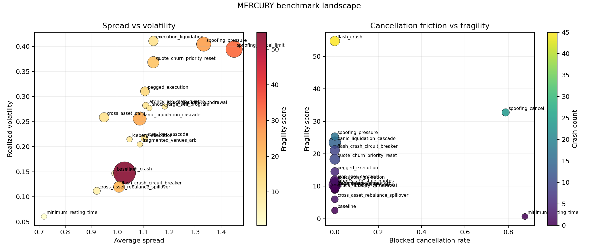
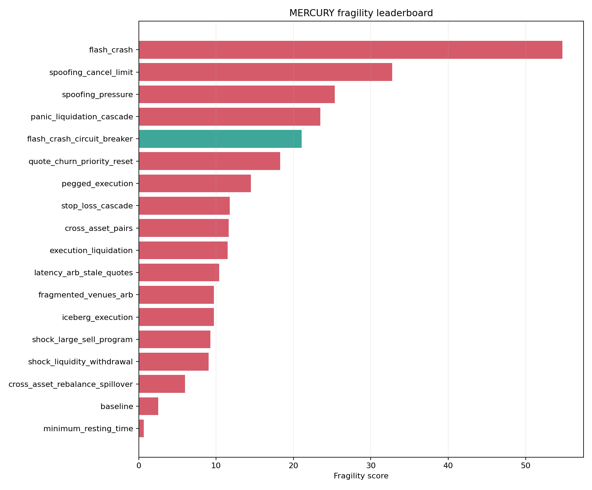

# MERCURY Research Report

## Benchmark Highlights

- Most fragile scenario: `flash_crash` with fragility `54.7493` and crash count `45.0000`.
- Most stable scenario: `minimum_resting_time` with fragility `0.6685`.
- Tightest spread: `minimum_resting_time` at average spread `0.7186`.
- Highest fill rate: `spoofing_pressure` at `0.8000`.
- Largest cross-asset dislocation: `cross_asset_rebalance_spillover` with mean absolute pair dislocation `0.8201`.
- Strongest rebalancer outcome: `cross_asset_rebalance_spillover` with rebalancer net PnL `9549.0000`.

## Fragility Table

| scenario | fragility_score_mean | flash_crash_count_mean | average_spread_mean | realized_volatility_mean |
| --- | --- | --- | --- | --- |
| flash_crash | 54.7493 | 45.0000 | 1.0285 | 0.1478 |
| spoofing_cancel_limit | 32.7424 | 24.0000 | 1.4503 | 0.3946 |
| spoofing_pressure | 25.3327 | 17.0000 | 1.3331 | 0.4046 |
| panic_liquidation_cascade | 23.4669 | 14.0000 | 1.0871 | 0.2558 |
| flash_crash_circuit_breaker | 21.0714 | 9.0000 | 1.0073 | 0.1199 |

## Cross-Asset Scenarios

| scenario | mean_absolute_pair_dislocation_mean | pair_spread_std_mean | return_correlation_mean | cojump_frequency_mean | tail_alignment_mean | crossed_market_frequency_mean | mean_crossed_market_width_mean | venue_arb_net_pnl_mean | rebalancer_net_pnl_mean |
| --- | --- | --- | --- | --- | --- | --- | --- | --- | --- |
| cross_asset_pairs | 0.7940 | 2.1343 | -0.0045 | 0.0000 | 0.0000 | 0.4938 | 35.5710 | 0.0000 | 0.0000 |
| cross_asset_rebalance_spillover | 0.8201 | 1.7233 | -0.0223 | 0.0000 | 0.0000 | 0.8345 | 35.6849 | 0.0000 | 9549.0000 |
| fragmented_venues_arb | 0.5503 | 0.9809 | -0.0067 | 0.0000 | 0.0000 | 0.0966 | 0.9134 | -10.5000 | 0.0000 |

## Benchmark Figures

## Sweep Highlights

- Sweep name: `flash_crash_resilience_grid`.
- Objective metric: `fragility_score_mean`.
- Best case: `case_00__maker_count_1__breaker_threshold_0p03` at `40.3512`.
- Worst case: `case_05__maker_count_2__breaker_threshold_0p07` at `74.7103`.

| case_id | fragility_score_mean | param_maker_count | param_breaker_threshold |
| --- | --- | --- | --- |
| case_00__maker_count_1__breaker_threshold_0p03 | 40.3512 | 1 | 0.0300 |
| case_06__maker_count_3__breaker_threshold_0p03 | 44.8355 | 3 | 0.0300 |
| case_07__maker_count_3__breaker_threshold_0p05 | 44.8355 | 3 | 0.0500 |
| case_03__maker_count_2__breaker_threshold_0p03 | 49.8584 | 2 | 0.0300 |
| case_01__maker_count_1__breaker_threshold_0p05 | 54.7493 | 1 | 0.0500 |

## Sweep Figures

## Reproducibility

- Run `python -m mercury.cli.app benchmark --output-dir ...` to regenerate benchmark artifacts.
- Run `python -m mercury.cli.app plot-benchmark --summary ... --output-dir ...` to regenerate benchmark figures.
- Run `python -m mercury.cli.app report-benchmark --summary ... --output ...` to regenerate this report.
- Run `python -m mercury.cli.app sweep --spec ... --output-dir ...` and `plot-sweep` to regenerate sweep artifacts.
