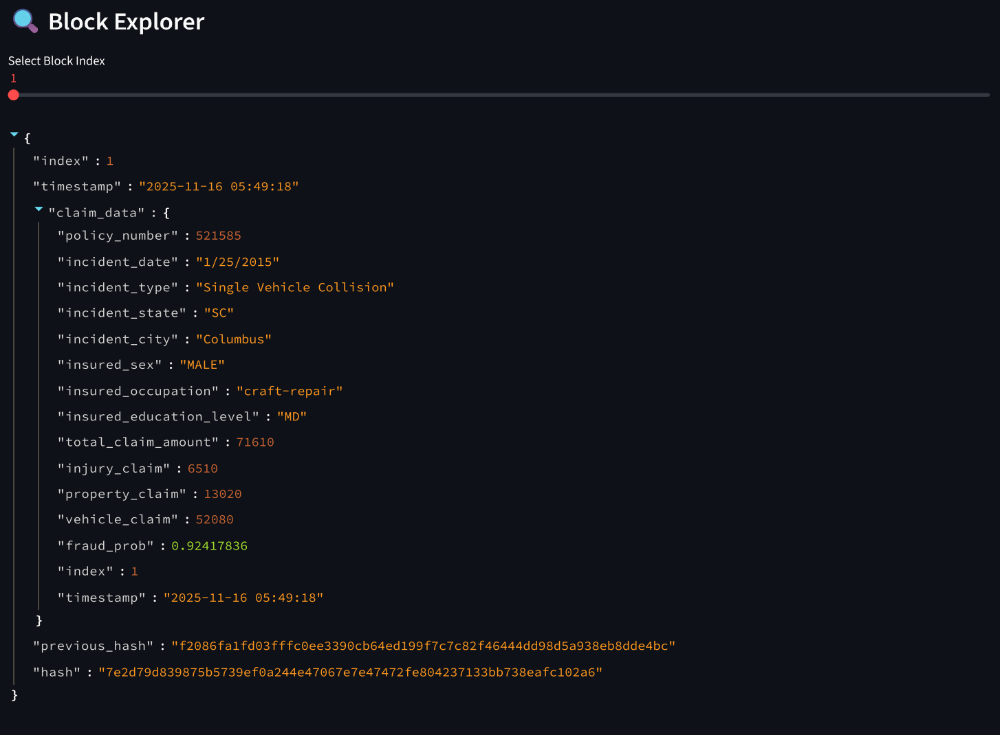

::: {.home-shell}
::: {.profile-sidebar}
{.profile-photo}

Data Science

### Markuss Saule

Decision-grade analytics for healthcare, markets, and operations

Business AnalyticsStatistics

I am a systems-first analytics builder focused on operational risk, bottlenecks, and decision thresholds in complex organizations.

<a class="btn-primary" href="https://www.linkedin.com/in/markuss-saule/" target="_blank" rel="noopener">LinkedIn</a>
<a class="btn-ghost" href="files/resume.pdf" target="_blank" rel="noopener">Resume PDF</a>

GPA<strong>4.0</strong>

Degree<strong>BS Business Analytics</strong>

Minors<strong>Statistics, Data Science</strong>

Core Stack<strong>Python, SQL, R, Power BI</strong>

:::

::: {.home-main}
::: {.hero-panel}

Decision-Grade Analytics for Complex Systems

# I build decision engines, not decorative dashboards.

I am a Business Analytics student at BYU-Idaho building high-consequence analytics for healthcare, market systems, and enterprise operations. My work is designed for environments where tradeoffs matter and decisions carry real cost.

Healthcare is personal to me. Family health challenges shaped how I define impact, and why I care about platform-level systems that improve outcomes at scale.

<a class="btn-primary" href="projects.html">View Projects</a>
<a class="btn-ghost" href="resume.html">Experience Timeline</a>

:::

## New Flagship

MERCURY extends the portfolio beyond dashboards and into full-system market design: exchange mechanics, stress testing, fragmented venues, and reproducible research artifacts.

::: {.flagship-panel}

New flagship build

### MERCURY: Market Microstructure Simulation Lab

MERCURY is a research-grade multi-agent exchange simulator built around a continuous double auction, endogenous price formation, heterogeneous trading agents, fragmented venues, and fee-aware venue economics.

It combines the engine and the communication layer: benchmark suites, parameter sweeps, publication-grade plots, and a reproducible research report that makes the system legible without opening the codebase first.

<strong>18</strong>built-in benchmark scenarios

<strong>67</strong>passing tests across the simulation core

<strong>45 to 9</strong>flash-crash detections after circuit breaker intervention

<strong>0.8201</strong>mean cross-asset dislocation captured in spillover runs

<a class="btn-primary" href="projects/mercury-market-sim.html">Explore MERCURY</a>
<a class="btn-ghost" href="files/mercury-market-sim/research_report.html" target="_blank" rel="noopener">Open Research Report</a>

:::

## Operating Doctrine

::: {.operating-grid}

<h4>Systems First</h4>
I model the full system before choosing metrics. Local optimization without systems context is noise.

<h4>Risk Explicitly</h4>
I surface thresholds, failure modes, and confidence bounds so leaders can act under uncertainty.

<h4>Bottlenecks Before Features</h4>
I prioritize constraints that limit throughput, access, and quality before adding complexity.

<h4>Tradeoffs Over Vanity KPIs</h4>
I design analytics around decision consequences, not dashboard aesthetics.

:::

## Selected Outcomes

<strong>1,150+</strong>Qualified applicants from optimized Meta campaigns

<strong>320%</strong>Hiring engagement lift from KPI dashboarding

<strong>70%</strong>Reporting time reduction via automation

<strong>114K+</strong>SEER patient records modeled for survival analysis

## Featured Projects

::: {.project-grid}
<a class="project-card" href="projects/mercury-market-sim.html">

Flagship

MERCURY: Market Microstructure Simulation Lab

Research-grade exchange simulation for liquidity stress, flash crashes, venue fragmentation, and fee-aware strategy interaction.

PythonSimulationMarket Microstructure

</a>
<a class="project-card" href="projects/fulfillment.html">

Fulfillment Center Risk Simulation and Staffing Optimization

SimPy-based engine with pressure scoring, risk signals, and staffing search for high-load operations.

PythonSimPyOptimization

</a>
<a class="project-card" href="projects/blockchain-fraud.html">

Blockchain + ML Healthcare Fraud Ledger

XGBoost fraud scoring combined with tamper-evident records for trust and auditability.

XGBoostSHA-256Streamlit

</a>
<a class="project-card" href="projects/insurance-fraud.html">

Insurance Fraud Detection

Model comparison from logistic regression to XGBoost with SHAP explainability and deployment artifacts.

scikit-learnXGBoostSHAP

</a>
<a class="project-card" href="projects/ai-scheduling.html">

AI-Powered Scheduling and Patient Access Optimization

Healthcare operations dashboard with forecasting, decomposition, and capacity visibility.

Power BIForecastingHealthcare Ops

</a>
<a class="project-card" href="projects/readmission.html">

Hospital Readmission Analytics

SQL schema design + R modeling + BI outputs to isolate readmission risk drivers and equity patterns.

SQLRPower BI

</a>
:::

<a class="btn-ghost" href="projects.html">See full project archive</a>

:::
:::
