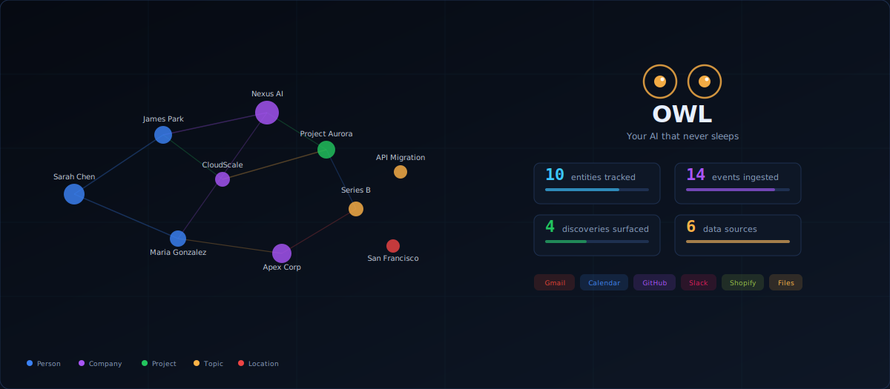

::: {.home-shell}
::: {.profile-sidebar}
{.profile-photo}

### Markuss Saule

Data and Analytics Specialist

Business AnalyticsStatistics

Data Science

I am a systems-first analytics builder focused on operational risk, bottlenecks, and decision thresholds in complex organizations.

<a class="btn-primary" href="https://www.linkedin.com/in/markuss-saule/" target="_blank" rel="noopener">LinkedIn</a>
<a class="btn-ghost" href="files/resume.pdf" target="_blank" rel="noopener">Resume PDF</a>

GPA<strong>4.0</strong>

Degree<strong>BS Business Analytics</strong>

Minors<strong>Statistics, Data Science</strong>

Core Stack<strong>Python, SQL, R, Power BI</strong>

:::

::: {.home-main}
::: {.hero-panel .reveal}

// Decision-Grade Analytics for Complex Systems

<h1 class="hero-h1">I build </h1>

Business Analytics student at BYU-Idaho building high-consequence analytics for healthcare, market systems, and enterprise operations. My work is designed for environments where tradeoffs matter and decisions carry real cost.

Healthcare is personal to me. Family health challenges shaped how I define impact, and why I care about platform-level systems that improve outcomes at scale.

<a class="btn-primary" href="projects.html">View Projects</a>
<a class="btn-ghost" href="resume.html">Experience Timeline</a>

:::

## New Flagship

OWL is the most ambitious system I've built — a full autonomous AI daemon with a knowledge graph, discovery engine, Electron desktop app, MCP server, and 5 deployment modes. Open source.

::: {.flagship-panel .reveal-scale}

// Flagship build

### OWL: Autonomous AI Discovery Daemon

OWL is a local-first Node.js daemon that watches your data sources — email, calendar, GitHub, Slack, Shopify — builds a living world model, and surfaces high-value discoveries when something matters. Desktop app, web dashboard, MCP server, Docker, and CLI.

It combines real-time data ingestion, LLM-powered analysis, cross-source correlation, anomaly detection, and a learning feedback loop into a single system that runs quietly on your machine with zero cloud dependencies.

<strong data-count="98">0</strong>passing tests across the full system

<strong data-count="7">0</strong>data source plugins with unified contract

<strong data-count="8">0</strong>delivery channels with rich formatting

<strong data-count="5">0</strong>deployment modes: CLI, Desktop, Web, Docker, MCP

<a class="btn-primary" href="projects/owl.html">Explore OWL</a>
<a class="btn-ghost" href="https://github.com/msaule/owl" target="_blank" rel="noopener">View on GitHub</a>

:::

## Operating Doctrine

::: {.operating-grid .reveal-stagger}

<h4>Systems First</h4>
I model the full system before choosing metrics. Local optimization without systems context is noise.

<h4>Risk Explicitly</h4>
I surface thresholds, failure modes, and confidence bounds so leaders can act under uncertainty.

<h4>Bottlenecks Before Features</h4>
I prioritize constraints that limit throughput, access, and quality before adding complexity.

<h4>Tradeoffs Over Vanity KPIs</h4>
I design analytics around decision consequences, not dashboard aesthetics.

:::

## Selected Outcomes

<strong data-count="1150" data-suffix="+">0</strong>Qualified applicants from optimized Meta campaigns

<strong data-count="320" data-suffix="%">0</strong>Hiring engagement lift via KPI dashboarding

<strong data-count="70" data-suffix="%">0</strong>Reporting time reduction via automation

<strong data-count="114" data-suffix="K+">0</strong>SEER patient records modeled for survival analysis

## Featured Projects

::: {.project-grid .reveal-stagger}
<a class="project-card" href="projects/owl.html">

Flagship

OWL: Autonomous AI Discovery Daemon

Local-first AI daemon with knowledge graph, discovery engine, Electron desktop app, MCP server, and 5 deployment modes.

Node.jsElectronSQLiteLLM

</a>
<a class="project-card" href="projects/mercury-market-sim.html">

MERCURY: Market Microstructure Simulation Lab

Research-grade exchange simulation for liquidity stress, flash crashes, venue fragmentation, and fee-aware strategy interaction.

PythonSimulationMarket Microstructure

</a>
<a class="project-card" href="projects/fulfillment.html">

Fulfillment Center Risk Simulation and Staffing Optimization

SimPy-based engine with pressure scoring, risk signals, and staffing search for high-load operations.

PythonSimPyOptimization

</a>
<a class="project-card" href="projects/blockchain-fraud.html">

Blockchain + ML Healthcare Fraud Ledger

XGBoost fraud scoring combined with tamper-evident records for trust and auditability.

XGBoostSHA-256Streamlit

</a>
<a class="project-card" href="projects/insurance-fraud.html">

Insurance Fraud Detection

Model comparison from logistic regression to XGBoost with SHAP explainability and deployment artifacts.

scikit-learnXGBoostSHAP

</a>
<a class="project-card" href="projects/ai-scheduling.html">

AI-Powered Scheduling and Patient Access Optimization

Healthcare operations dashboard with forecasting, decomposition, and capacity visibility.

Power BIForecastingHealthcare Ops

</a>
:::

<a class="btn-ghost" href="projects.html">See full project archive</a>

:::
:::
