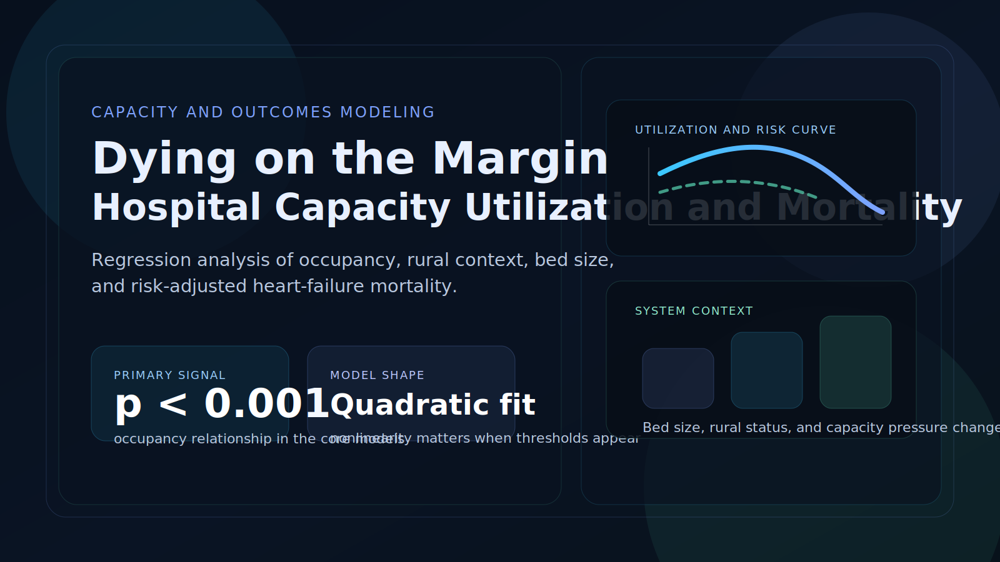

{.cover-image}

## Overview

This project studies how hospital capacity utilization relates to risk-adjusted heart-failure mortality. Rather than treating occupancy as a simple efficiency metric, the report models it as a systems signal tied to operating pressure, hospital type, and outcome risk. The result is a regression-based view of where utilization becomes analytically meaningful for stakeholders thinking about capacity management.

::: {.hero-actions}
[Open HTML Report](../files/dying-on-the-margin/dying-on-the-margin.html){.btn-primary target="_blank" rel="noopener"}
[Back to Project Archive](../projects.html){.btn-ghost}
:::

## What I Did

- Built a hospital-level analytical workflow around occupancy, bed size, teaching status, rural context, and risk-adjusted mortality outcomes.
- Fit and compared multiple regression specifications, including simple linear, multivariable, quadratic, and rural-interaction models.
- Ran model diagnostics and hypothesis testing so the interpretation rests on more than a single coefficient table.
- Framed the findings for stakeholder use, emphasizing predictive signal and operational interpretation rather than overstating causality.

## Results/Impact

- The simple linear model found a negative association between occupancy and heart-failure mortality, with an estimated slope of about `-2.8731` and `p < 0.001`.
- The quadratic specification strengthened the story, with a centered linear term of about `-1.749` and a negative quadratic term of about `-4.4503`, indicating meaningful curvature in the relationship.
- Rural hospitals showed higher mortality than otherwise similar urban hospitals in the modeled results, reinforcing the importance of structural context.
- The report turns a counterintuitive result into a more useful decision question: what does utilization reveal about hospital capability mix, operating pressure, and threshold risk?

## Tech Stack

- R
- Regression modeling
- Quarto
- Hospital outcomes analysis
- Model diagnostics and hypothesis testing
- Healthcare capacity analytics

## Deliverables

- [Self-contained HTML report](../files/dying-on-the-margin/dying-on-the-margin.html)
- Source notebook / script bundle: (add file)
- Supporting data extract: (add file)

## Analytical Takeaways

::: {.operating-grid}

<h4>Occupancy Is Not Just An Ops Metric</h4>
The analysis treats utilization as a risk signal tied to outcomes, not only as a throughput or efficiency measure.

<h4>Nonlinearity Matters</h4>
A quadratic model fits better than a purely linear story, which is exactly what you want to test when thresholds and strain may matter.

<h4>Context Changes Interpretation</h4>
Rural status and bed size alter the picture, so capacity cannot be interpreted responsibly without hospital context.

<h4>Predictive, Not Causal</h4>
The right reading is disciplined: these models identify signal and structure, not a simplistic causal claim that fuller hospitals are inherently safer.

:::

## Why It Matters

This project fits the kind of healthcare analytics work I care about most: operational questions with real outcome stakes, ambiguous signals, and the need for careful interpretation. Capacity decisions sit at the intersection of access, staffing, quality, and risk. This report shows how to approach that problem rigorously instead of reducing it to a single occupancy target.
