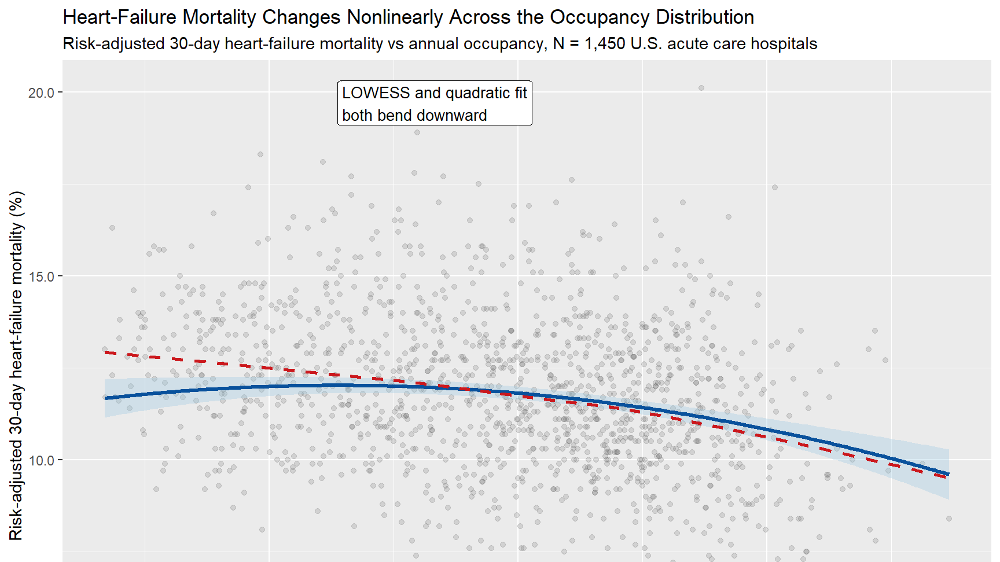
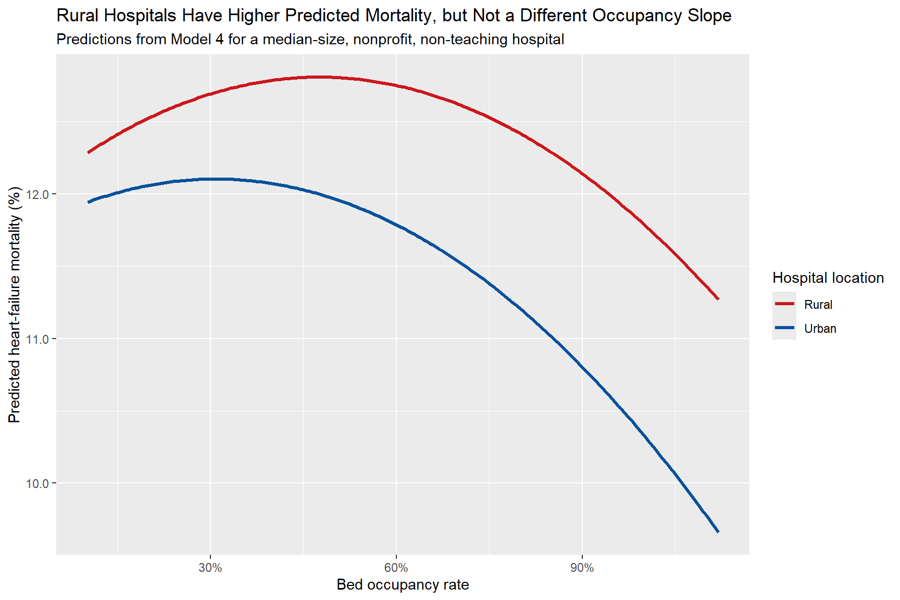
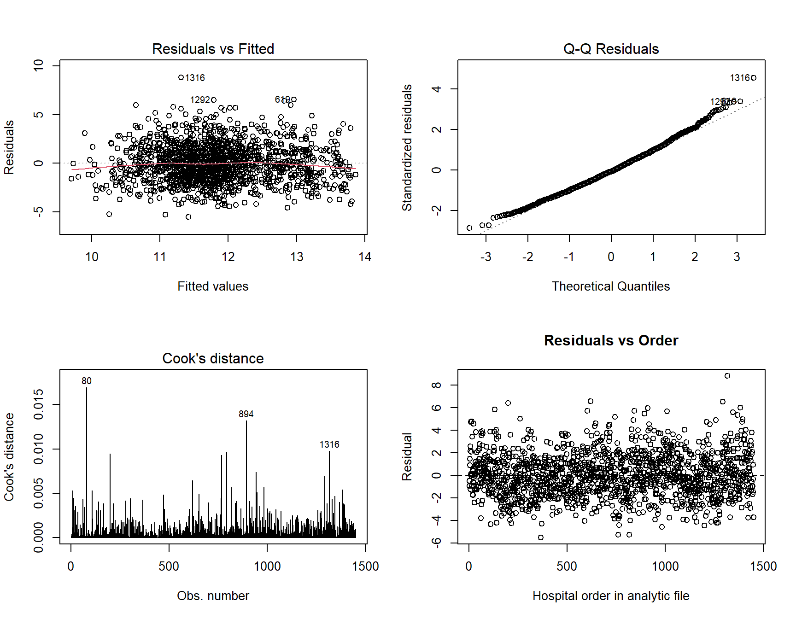
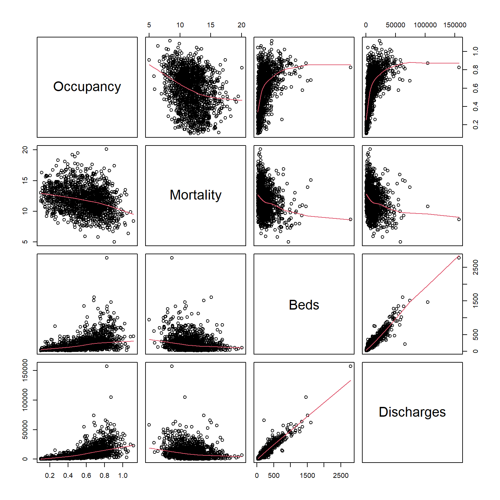

{.cover-image}

## Overview

This project studies how hospital capacity utilization relates to risk-adjusted heart-failure mortality. Rather than treating occupancy as a simple efficiency metric, the report models it as a systems signal tied to operating pressure, hospital type, and outcome risk. The result is a regression-based view of where utilization becomes analytically meaningful for stakeholders thinking about capacity management.

::: {.hero-actions}
[Open HTML Report](../files/dying-on-the-margin/dying-on-the-margin.html){.btn-primary target="_blank" rel="noopener"}
[Back to Project Archive](../projects.html){.btn-ghost}
:::

## What I Did

- Built a hospital-level analytical workflow around occupancy, bed size, teaching status, rural context, and risk-adjusted mortality outcomes.
- Fit and compared multiple regression specifications, including simple linear, multivariable, quadratic, and rural-interaction models.
- Ran model diagnostics and hypothesis testing so the interpretation rests on more than a single coefficient table.
- Framed the findings for stakeholder use, emphasizing predictive signal and operational interpretation rather than overstating causality.

## Analytical Workflow

- Constructed the sample around U.S. acute care hospitals with the variables needed to compare occupancy, discharges, bed count, and risk-adjusted heart-failure mortality on the same analytic frame.
- Started with a simple linear model, then progressively added controls and structure to test whether the occupancy signal held up under a stronger specification.
- Added a quadratic term to test whether the relationship bends at different utilization levels rather than staying mechanically linear across the whole range.
- Tested a rural interaction to see whether the occupancy slope itself changes by hospital setting, then reviewed diagnostic outputs to check model behavior and outlier influence.

## Results/Impact

- The simple linear model found a negative association between occupancy and heart-failure mortality, with an estimated slope of about `-2.8731` and `p < 0.001`.
- The quadratic specification strengthened the story, with a centered linear term of about `-1.749` and a negative quadratic term of about `-4.4503`, indicating meaningful curvature in the relationship.
- Rural hospitals showed higher mortality than otherwise similar urban hospitals in the modeled results, reinforcing the importance of structural context.
- The report turns a counterintuitive result into a more useful decision question: what does utilization reveal about hospital capability mix, operating pressure, and threshold risk?

## Tech Stack

- R
- Regression modeling
- Quarto
- Hospital outcomes analysis
- Model diagnostics and hypothesis testing
- Healthcare capacity analytics

## Deliverables

- [Self-contained HTML report](../files/dying-on-the-margin/dying-on-the-margin.html)
- Source notebook / script bundle: (add file)
- Supporting data extract: (add file)

## Report Visuals

::: {.viz-grid}
::: {.viz-card}

**Rural versus urban prediction curves.** Rural hospitals remain at a higher predicted mortality level, even though the occupancy slope itself is not meaningfully different.
:::
::: {.viz-card}

**Model diagnostics.** Residual and influence checks help keep the interpretation disciplined instead of relying on coefficient tables alone.
:::
:::

::: {.viz-grid}
::: {.viz-card}

**Variable structure.** The exploratory view shows how occupancy, mortality, bed count, and discharges relate before formal modeling.
:::
::: {.viz-card}

**Nonlinear occupancy pattern.** The headline visual shows why a purely linear story would miss important structure in the relationship.
:::
:::

## Analytical Takeaways

::: {.operating-grid}

<h4>Occupancy Is Not Just An Ops Metric</h4>
The analysis treats utilization as a risk signal tied to outcomes, not only as a throughput or efficiency measure.

<h4>Nonlinearity Matters</h4>
A quadratic model fits better than a purely linear story, which is exactly what you want to test when thresholds and strain may matter.

<h4>Context Changes Interpretation</h4>
Rural status and bed size alter the picture, so capacity cannot be interpreted responsibly without hospital context.

<h4>Predictive, Not Causal</h4>
The right reading is disciplined: these models identify signal and structure, not a simplistic causal claim that fuller hospitals are inherently safer.

:::

## What The Findings Mean

The most important contribution of this project is not just that occupancy was statistically significant. It is that the relationship becomes more interpretable once the model stops pretending the entire occupancy range behaves the same way. The quadratic fit suggests there is structure in how utilization and mortality move together, and the rural comparison shows that baseline context still matters even when the occupancy slope itself does not break apart cleanly by geography.

That matters for operators because capacity is rarely a neutral efficiency metric. It sits inside staffing constraints, referral patterns, service mix, transfer behavior, and the overall maturity of the hospital system. The right stakeholder takeaway is not to maximize occupancy or minimize occupancy blindly. It is to treat utilization as a signal that needs context, thresholds, and model-based interpretation.

## Why It Matters

This project fits the kind of healthcare analytics work I care about most: operational questions with real outcome stakes, ambiguous signals, and the need for careful interpretation. Capacity decisions sit at the intersection of access, staffing, quality, and risk. This report shows how to approach that problem rigorously instead of reducing it to a single occupancy target.

## Limits And Next Questions

This is still observational analysis, so the strongest claim here is predictive structure rather than causality. A next step would be to segment by service mix, ownership type, or hospital referral role, and to test whether similar patterns hold for other outcome measures beyond heart-failure mortality. That would make the capacity signal even more useful for operations and quality teams deciding where to investigate further.
