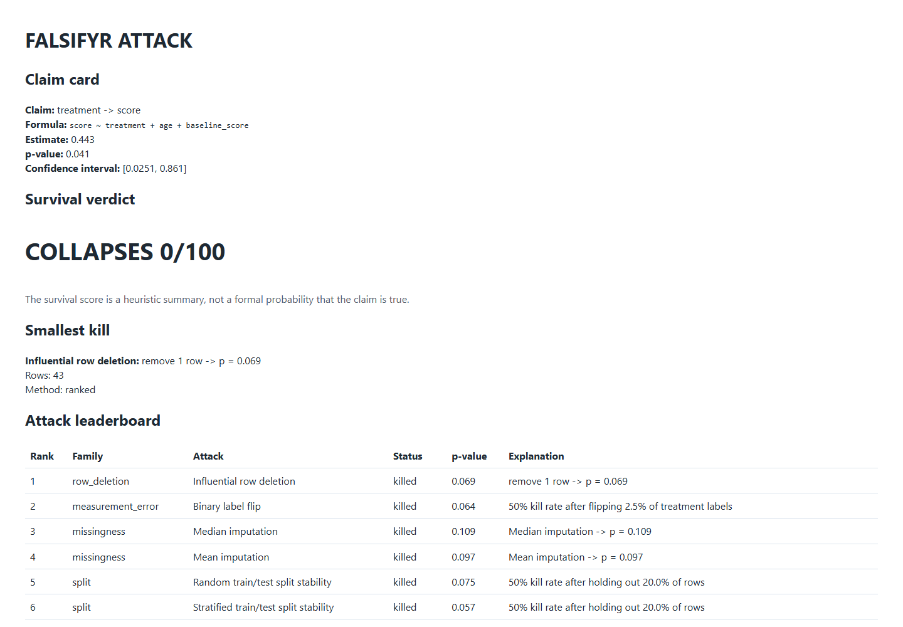
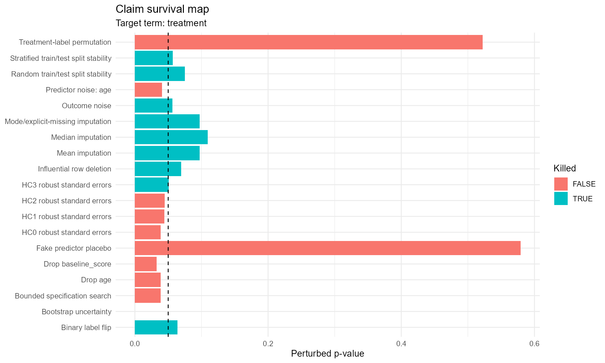

{.cover-image .cover-contain}

::: {.hero-actions}
[Open Attack Report](../files/falsifyr/attack-report.html){.btn-primary target="_blank" rel="noopener"}
:::

## Overview

`falsifyr` is an R package that asks a blunt question before a statistical result is trusted: what is the smallest plausible change that makes this claim disappear?

The package takes an `lm`, `glm`, or supported hypothesis-test result, extracts the target claim, runs a controlled set of adversarial checks, and ranks the weakest assumptions. Instead of returning another diagnostics panel, it reports the smallest kill: the least severe row deletion, missing-data choice, label perturbation, standard-error change, specification change, placebo, or sample split that overturns the conclusion.

The language is careful by design. A claim that dies under an attack is fragile under that attack. That does not prove the claim is false.

::: {.proof-grid}

<strong>11</strong>exported functions

<strong>65</strong>testthat test blocks

<strong>8</strong>attack families

<strong>0.1.0</strong>current package version

:::

## Why I Built It

Statistical work often stops too early. A coefficient crosses a threshold, the model prints stars, and the result moves into a report. Traditional diagnostics help, but they are split across functions and usually require the analyst to decide which robustness checks to run.

I wanted one workflow that treated a fitted claim as something to attack. The package should search for the smallest reasonable perturbation, show exactly what changed, preserve reproducibility metadata, and distinguish between a result that survives and one that depends on a narrow assumption.

That makes `falsifyr` useful both as an analysis tool and as a discipline. It encourages the analyst to look for failure before presenting certainty.

## Attack Families

- **Row deletion:** ranked, greedy, and beam-search strategies look for influential observations or small groups that change the claim.
- **Standard errors:** bootstrap uncertainty and optional HC0-HC3 robust standard errors test whether the conclusion depends on the original variance assumption.
- **Covariate dependence:** drop-one checks show whether the claim survives small formula changes.
- **Missingness:** mean, median, mode, and explicit-missing treatments test common imputation choices.
- **Measurement error:** controlled noise and binary-label flips test sensitivity to imperfect measurement.
- **Placebos:** treatment-label permutation, fake predictors, and user-supplied placebo outcomes look for patterns the original claim should not produce.
- **Specification search:** bounded formula search identifies a small defensible model change that kills the result.
- **Split stability:** random and stratified train/test refits test whether the conclusion survives reasonable sample partitions.

## A Real Attack Report

The example below starts with a treatment coefficient of 0.443 and a p-value of 0.041. The ordinary model output looks publishable. `falsifyr` finds that removing one influential row raises the p-value to 0.069, while several missingness, measurement-error, and split-stability attacks also overturn the claim.

::: {.viz-grid}
::: {.viz-card}

**HTML attack report.** The claim card, survival verdict, smallest kill, and ranked leaderboard make the weak point visible before the full technical appendix.
:::

::: {.viz-card}

**Survival map.** Attack families are compared by status and severity so the analyst can see which assumptions matter and which checks the claim survives.
:::
:::

## Package Design

The package API is deliberately small. `attack()` runs the analysis, `smallest_kill()` returns the leading failure, `attack_leaderboard()` exposes ranked results, `score_survival()` summarizes resilience, and `report()` writes a static HTML review. S3 print and plot methods keep the workflow natural inside R.

An optional RStudio addin can find supported model objects in the active session and launch the same attack workflow without requiring the analyst to assemble a long function call. Vignettes cover regression attacks, survival scores, and responsible interpretation.

Reproducibility information travels with the result: formula, term, alternative hypothesis, seed, attack settings, package version, R version, and session details. Deterministic attacks remain deterministic under a fixed seed.

## CRAN Readiness

The package is CRAN-targeted but not yet CRAN-published. A local `R CMD check --as-cran` completes with tests passing and two notes:

1. The maintainer field still uses placeholder metadata and must be replaced before submission.
2. The local Windows environment could not verify current time during the check.

I am keeping that status explicit. Once the maintainer metadata is final, the remaining work is multi-platform checking, `cran-comments.md`, policy review, and submission. Until CRAN accepts it, the accurate description is "CRAN-targeted," not "CRAN-approved."

## Results and Impact

- Consolidates eight robustness families behind one claim-centered workflow.
- Finds and ranks the smallest perturbation that changes a statistical conclusion.
- Produces a static report that can travel with an analysis or model review.
- Supports both fragile and resilient examples so the tool does not assume every claim should fail.
- Preserves caveats and unavailable attacks instead of silently omitting them.
- Adds an RStudio-native path through an optional addin.

## Tech Stack

- R package development, roxygen2, testthat, S3 methods
- ggplot2, tibble, vctrs, rlang, cli
- Optional sandwich and lmtest support for robust standard errors
- RStudio addin, vignettes, static HTML reporting
- `R CMD check --as-cran` release workflow

## Boundaries

- A killed claim is fragile under a defined attack; it is not proven false.
- A survival score is a heuristic summary, not the probability that a claim is true.
- Supported attacks depend on the fitted object and retained source data.
- Automated robustness testing does not replace study design, domain expertise, or causal identification.

## Deliverables

- [Generated attack report](../files/falsifyr/attack-report.html){target="_blank" rel="noopener"}
- Package source currently maintained as a private pre-release build

