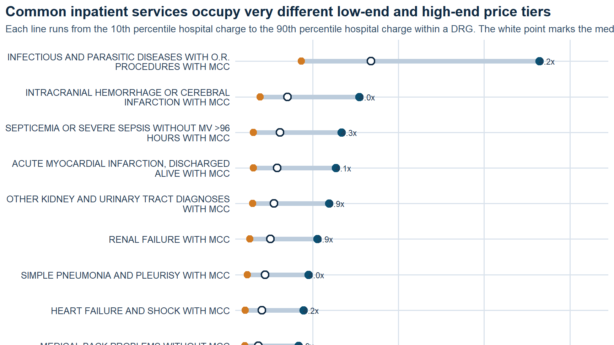
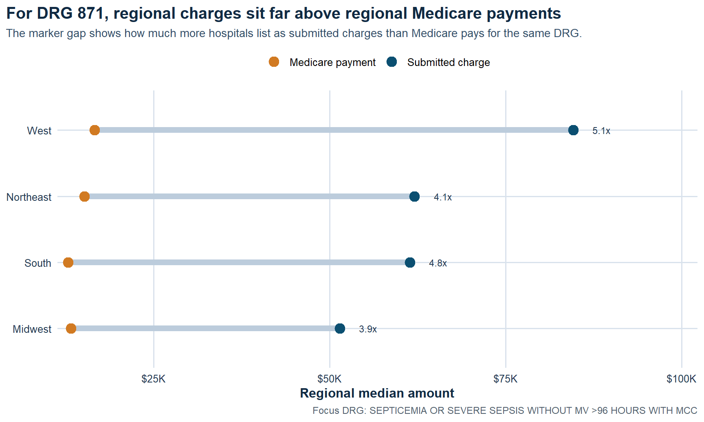
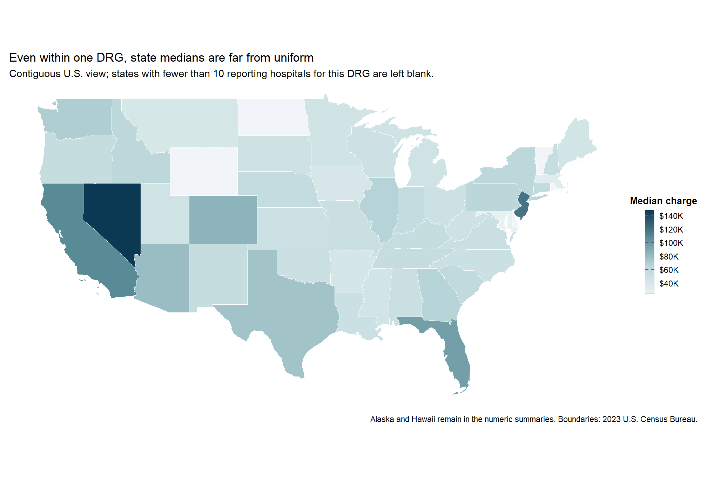
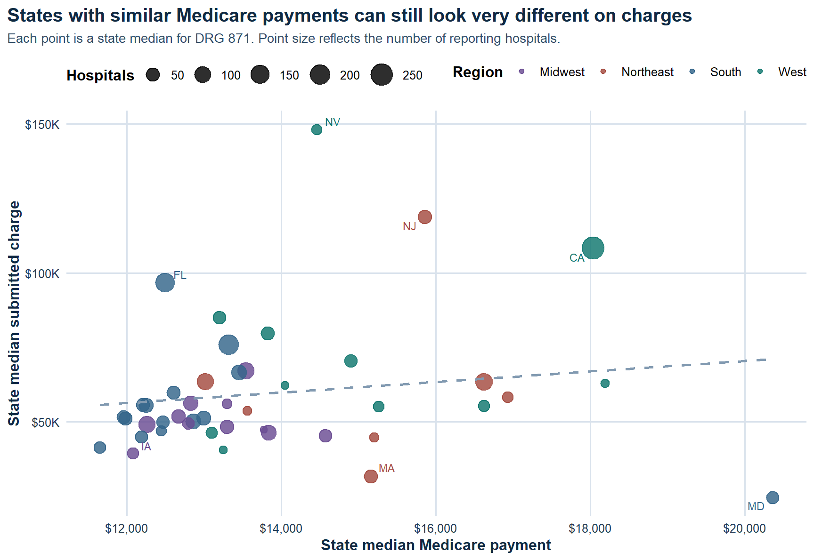

{.cover-image}

## Overview

This project analyzes how much hospital submitted charges can vary for the same inpatient service, and how those charges compare with Medicare payments for comparable stays. Using 2023 CMS inpatient hospital pricing data, I built a benchmarking report that compares DRG-level charges across states, regions, and hospital market contexts to show where pricing gaps widen most sharply.

::: {.hero-actions}
[Open HTML Report](../files/hospital-prices/hospital-price-variation-report.html){.btn-primary target="_blank" rel="noopener"}
[Back to Project Archive](../projects.html){.btn-ghost}
:::

## What I Did

- Focused the analysis on comparable inpatient services so price dispersion could be evaluated on an apples-to-apples basis.
- Benchmarked submitted hospital charges against Medicare payments to quantify the charge-to-payment gap instead of looking at charge levels in isolation.
- Segmented results by census region, state, and metro status to surface where pricing patterns remain structurally different.
- Packaged the full analysis as a polished, self-contained HTML report suitable for portfolio review and stakeholder sharing.

## Analytical Workflow

- Imported and cleaned the 2023 CMS inpatient hospital pricing extract in R, then narrowed the analysis to DRGs with enough reporting density to support fair comparisons.
- Built a focal comparison around a high-volume inpatient service so the charts would compare like with like instead of mixing unrelated procedures.
- Computed percentile spread, state medians, regional medians, and charge-to-payment ratios to translate raw hospital charge tables into interpretable benchmark views.
- Designed the report sequence to move from service-level dispersion, to regional gaps, to state-level spread, and then to the charge-versus-payment disconnect.

## Results/Impact

- Found a wide gap inside the same focus DRG: about `$30,936` at the 10th percentile versus about `$133,639` at the 90th percentile.
- Identified a strong regional payment disconnect: in the West, median submitted charges were about `5.1x` median Medicare payments for the same DRG.
- Showed that metropolitan hospitals tend to post much higher submitted charges than small-town and rural hospitals even when Medicare payments stay comparatively close.
- Quantified sharp state-level dispersion, with reported median charges ranging from about `$24,611` in Maryland to about `$148,155` in Nevada for the focal service.

## Tech Stack

- R
- Quarto
- CMS inpatient hospital pricing data
- Medicare payment benchmarking
- Regional and state segmentation
- ggplot-based analytical reporting

## Deliverables

- [Self-contained HTML report](../files/hospital-prices/hospital-price-variation-report.html)
- Source notebook / script bundle: (add file)
- Supporting data extract: (add file)

## Report Visuals

::: {.viz-grid}
::: {.viz-card}

**Regional charge gap.** For the focal DRG, submitted charges sit far above Medicare payments in every region, with the West showing the widest separation.
:::
::: {.viz-card}

**State median spread.** Even within one inpatient service, median submitted charges vary sharply across states instead of clustering around a narrow benchmark.
:::
:::

::: {.viz-grid}
::: {.viz-card}

**Payment disconnect.** Higher submitted charges do not buy proportionally higher Medicare payments, which is exactly why the pricing gap is the better operational signal.
:::
::: {.viz-card}

**Within-service dispersion.** The same DRG can occupy very different low-end and high-end price tiers depending on hospital context.
:::
:::

## Key Findings

::: {.operating-grid}

<h4>Comparable Services, Very Different Prices</h4>
The analysis isolates a common inpatient service and still finds a dramatic spread between low-charge and high-charge hospitals.

<h4>Charges And Payments Diverge</h4>
Submitted charges often move far more than Medicare payments, which makes the gap itself a more useful signal than list price alone.

<h4>Regional Structure Matters</h4>
The strongest differences are not random noise. Region, state, and metro context all shape where hospitals sit in the pricing distribution.

<h4>Useful For Benchmarking</h4>
This is the kind of analysis that helps frame pricing conversations around relative position, not just single-hospital anecdotes.

:::

## What A Stakeholder Should Take From This

This report is useful because it reframes hospital price variation as a benchmarking problem instead of a headline problem. If the same inpatient service can sit in radically different price tiers, then a hospital needs to understand its pricing posture relative to peers, not just its own internal trend. The clearest signal is not whether a charge is high in absolute terms, but how far it sits from comparable hospitals and how wide the gap is relative to Medicare payment benchmarks.

For leadership, that matters in at least three ways. First, it helps identify where pricing may be difficult to defend in payer or employer negotiations. Second, it clarifies whether regional norms are doing most of the explanatory work or whether a hospital is positioned unusually high even within its own market. Third, it creates a cleaner bridge between descriptive pricing analysis and the next layer of work: payer mix, margin, reimbursement strategy, and price transparency.

## Why It Matters

Healthcare pricing is easy to discuss abstractly and hard to benchmark well. This project turns that conversation into a structured comparison problem: same service, same payment reference point, different hospital context. That makes the output more useful for understanding variation, pricing posture, and where a hospital sits relative to peers.

## Limits And Next Questions

The analysis is intentionally descriptive. It shows where price dispersion exists and how submitted charges diverge from Medicare payments, but it does not claim that charges translate directly into realized collections or patient liability. A logical next step would be to layer in payer-specific reimbursements, service mix within DRGs, ownership type, and hospital financial performance so the pricing posture can be interpreted with more business context.
