{.cover-image}

## Overview

MERCURY is a research-grade market microstructure simulator built as a full system rather than a notebook demo. At its core is a continuous double auction with price-time priority, a realistic limit order book, heterogeneous agent behavior, endogenous price formation, and explicit stress propagation. Around that core, I built benchmark suites, parameter sweeps, publication-grade plots, and a reproducible reporting pipeline so the project can function as both a simulator and a research artifact.

## What I Did

- Architected the exchange core with limit-order-book mechanics, partial fills, cancels, replace logic, iceberg orders, pegged orders, and maker-taker accounting.
- Designed heterogeneous agents for market making, momentum, arbitrage, execution, panic selling, stop-loss cascades, spoofing, and venue arbitrage.
- Added market-structure experiments for flash crashes, cross-asset spillovers, fragmented venues, liquidity withdrawal, and regulation controls such as circuit breakers.
- Built benchmark, sweep, plotting, and report-generation workflows so the system can run scenario families and publish polished outputs automatically.
- Validated the platform with an automated test suite covering matching logic, metrics, reporting, and visualization workflows.

## Results/Impact

- Benchmarked 18 built-in scenarios spanning baseline trading, flash-crash dynamics, cross-asset spillovers, fragmented venues, and fee economics.
- Reached 67 passing tests across the simulator core, benchmark tooling, and reporting pipeline.
- Reduced flash-crash fragility from 54.7493 to 21.0714 and crash detections from 45 to 9 when circuit breakers were enabled.
- Captured mean cross-asset dislocation of 0.8201 and rebalancer net PnL of 9549.0 in spillover experiments.
- Measured crossed-market frequency of 0.0966 and mean crossed width of 0.9134 in fragmented-venue benchmarks.

## Tech Stack

- Python, Agent-Based Simulation, Market Microstructure, Continuous Double Auction, Limit Order Books, Matplotlib, Pytest, YAML, Quarto, Reproducible Research Tooling

## Deliverables

- [Research report (HTML)](../files/mercury-market-sim/research_report.html)
- [Research report (Markdown)](../files/mercury-market-sim/research_report.md)
- [Project README](../files/mercury-market-sim/README.md)
- [Benchmark summary](../files/mercury-market-sim/benchmark-summary.md)
- [Sweep summary](../files/mercury-market-sim/sweep-summary.md)
- [Reproduction commands](../files/mercury-market-sim/reproduce_commands.txt)

## Benchmark Landscape

The benchmark layer turns the simulator into a decision surface instead of a single scenario demo. It makes spread, volatility, fragility, crash intensity, and venue economics visible across a consistent scenario family.

::: {.viz-grid}
::: {.viz-card}

**Benchmark landscape.** Spread, volatility, fragility, and crash intensity are mapped together so unstable regimes separate cleanly from merely active ones.
:::
::: {.viz-card}

**Fragility leaderboard.** The stress ranking makes it immediately clear which market structures become brittle under pressure.
:::
:::

::: {.viz-grid}
::: {.viz-card}
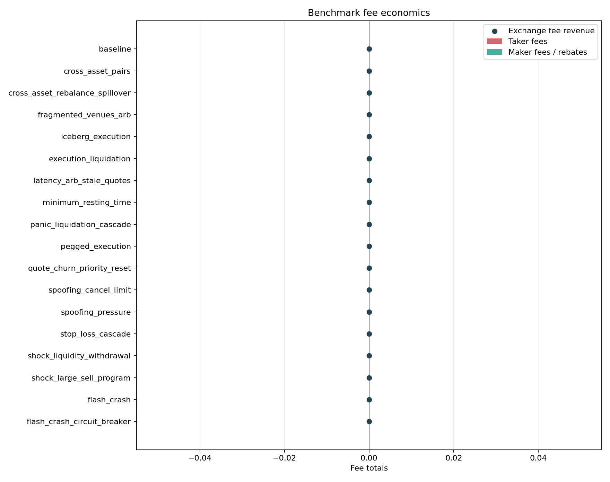
**Fee economics.** Maker rebates, taker fees, and net exchange revenue are measured directly instead of being treated as background assumptions.
:::
::: {.viz-card}
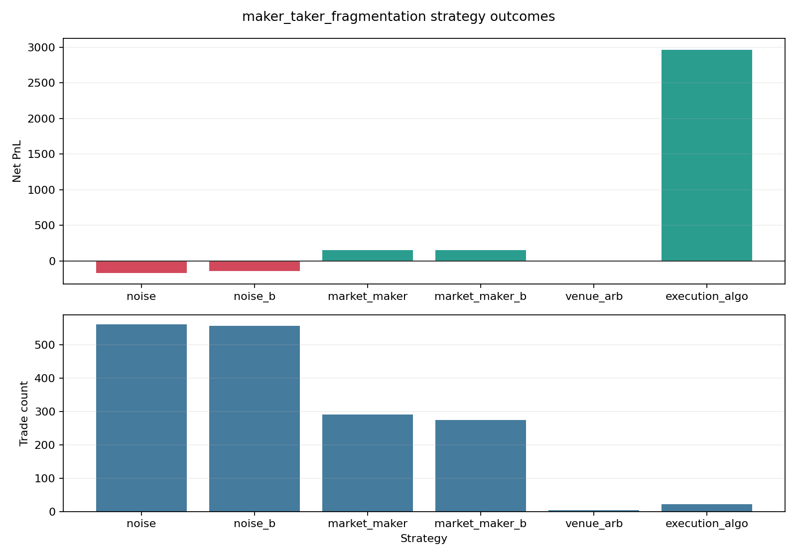
**Strategy PnL under fees.** Venue economics materially change routing incentives and who wins under fragmented liquidity.
:::
:::

## Signature Experiments

### Flash Crash Formation

MERCURY can generate endogenous crash behavior from interacting strategies and liquidity conditions rather than relying on a simple exogenous price drop. That is the difference between a price toy and a market-structure lab.

::: {.viz-grid}
::: {.viz-card}
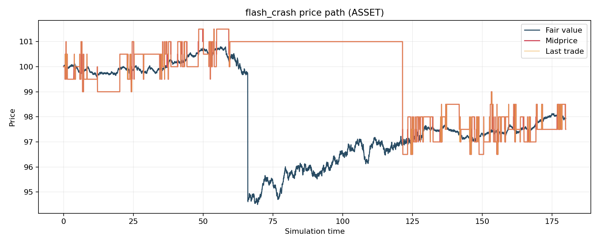
**Price path under stress.** Crash formation emerges from order flow, liquidity withdrawal, and feedback loops inside the book.
:::
::: {.viz-card}
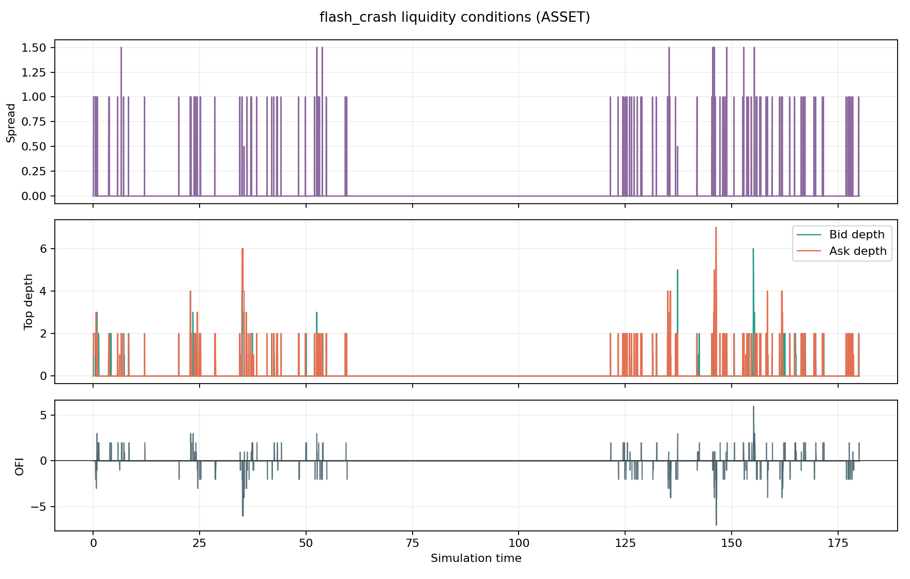
**Liquidity conditions.** Spreads widen and displayed depth thins rapidly once the market moves into a fragile regime.
:::
:::

### Cross-Asset Spillovers

The simulator is not confined to a single order book. It supports correlated assets, cross-asset fair values, pairs logic, and institutional rebalancing so spillovers can be modeled directly.

::: {.viz-grid}
::: {.viz-card}
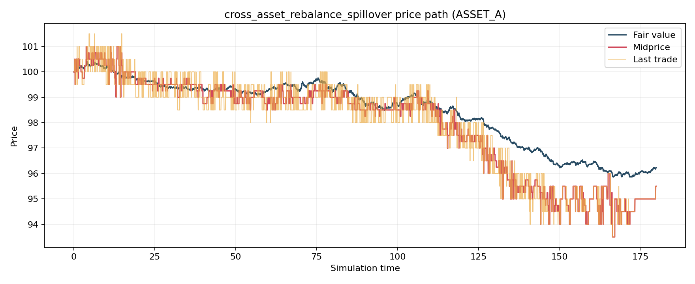
**Cross-asset price path.** Spillovers propagate across linked assets rather than remaining isolated to one venue.
:::
::: {.viz-card}
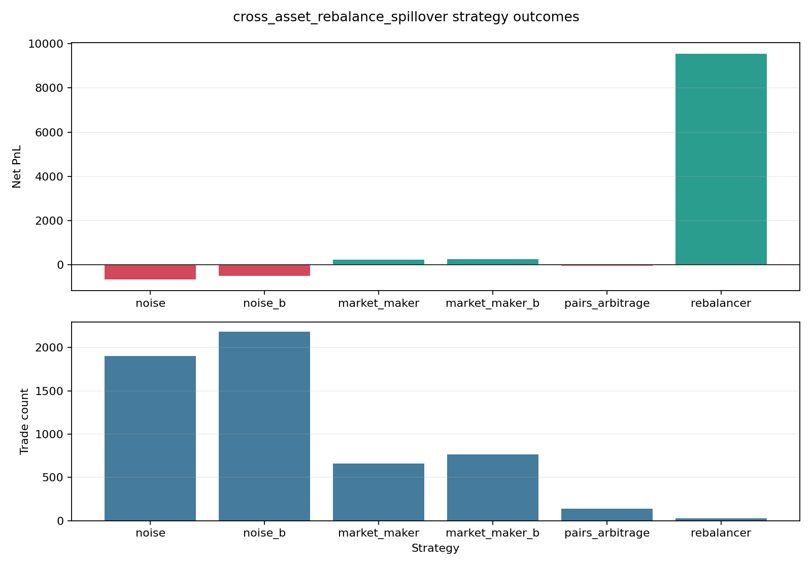
**Cross-asset strategy PnL.** Rebalancing and arbitrage behavior become measurable outputs instead of assumed narratives.
:::
:::

### Fragmented Venues And Repair

MERCURY can reinterpret multi-asset infrastructure as fragmented venues for the same underlying. That makes crossed markets, best-execution pressure, and venue arbitrage observable instead of hand-waved.

::: {.viz-grid}
::: {.viz-card}
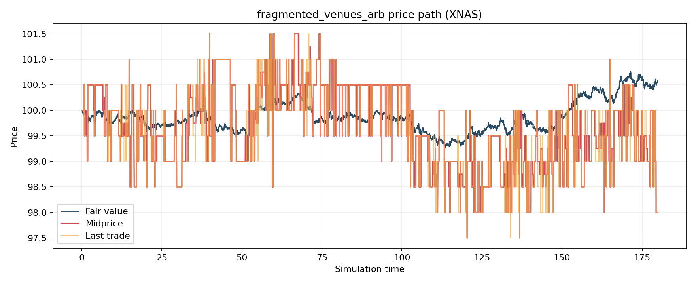
**Fragmented venues.** The price-path view shows how dislocations open and get repaired when venues compete for flow.
:::
::: {.viz-card}
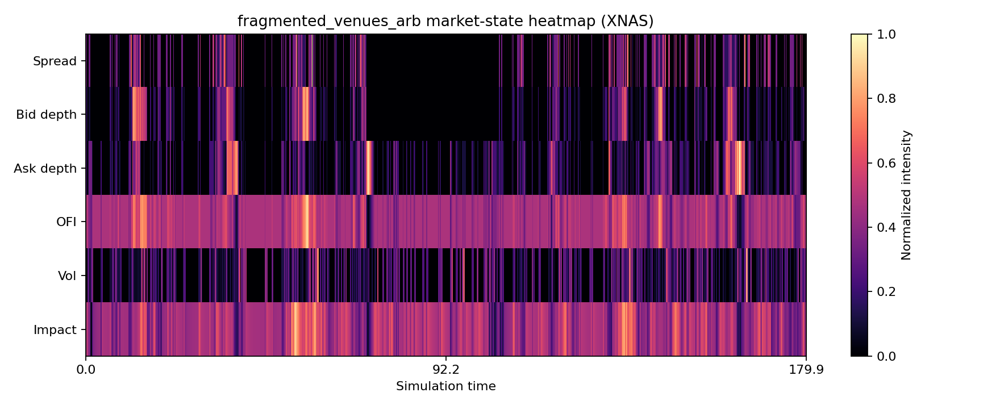
**Market-state heatmap.** Fragmentation is visible as a structural pattern, not just a line on a chart.
:::
:::

## Research Workflow

The project is stronger because it does not stop at simulation. It can run benchmark families, sweep parameters, rank cases by an objective metric, and publish a reproducible report bundle that others can inspect without rebuilding the environment from scratch.

::: {.viz-grid}
::: {.viz-card}
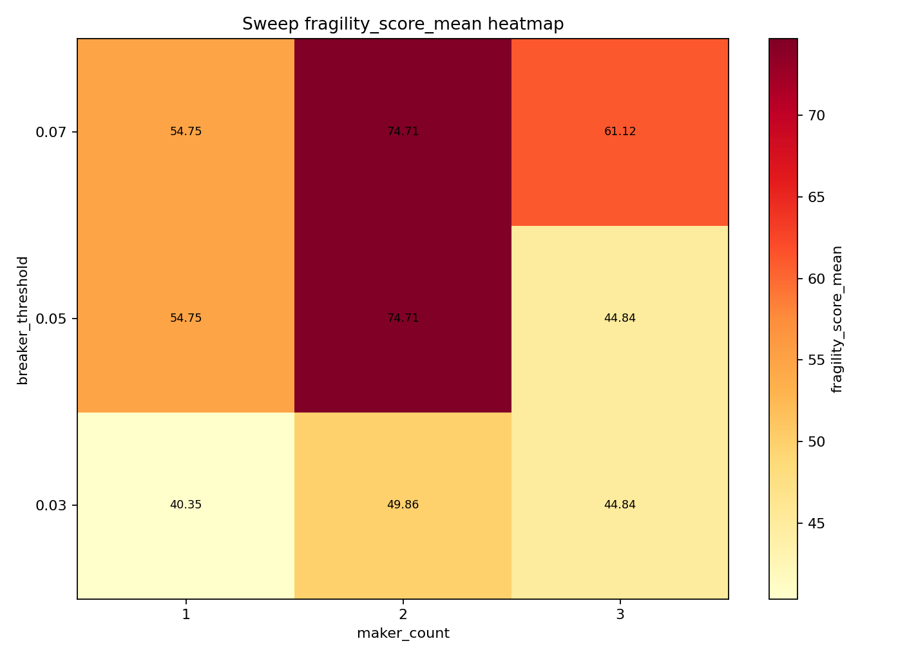
**Sweep objective.** The research workflow tracks fragility directly and compares scenario families against the target metric.
:::
::: {.viz-card}
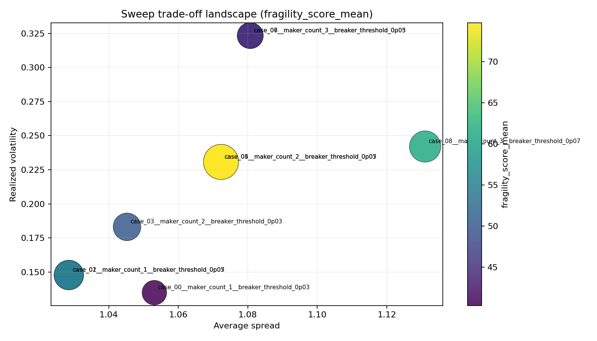
**Tradeoff surface.** Parameter changes are evaluated as explicit tradeoffs rather than isolated wins.
:::
:::

::: {.viz-grid}
::: {.viz-card}
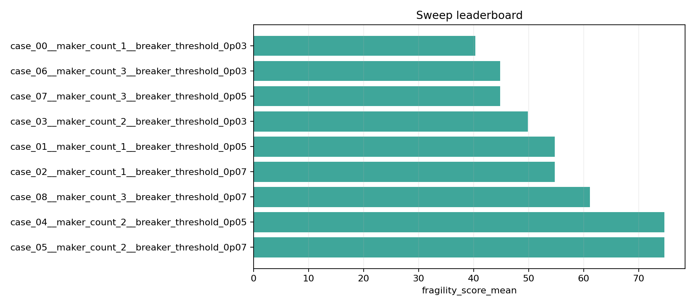
**Sweep leaderboard.** Best and worst cases are ranked automatically, which makes parameter tuning auditable and repeatable.
:::
::: {.viz-card}
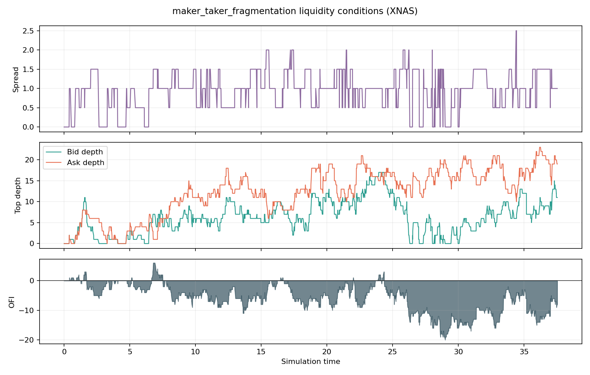
**Liquidity response.** The platform captures how fee structures and participant behavior reshape depth and market quality.
:::
:::

## Why This Project Matters

MERCURY is the kind of work that signals systems thinking, modeling discipline, and software engineering at the same time. It is not a dashboard layer looking for a story. It is an actual simulation and research platform with outputs that can support discussion about stability, regulation, and market design.
