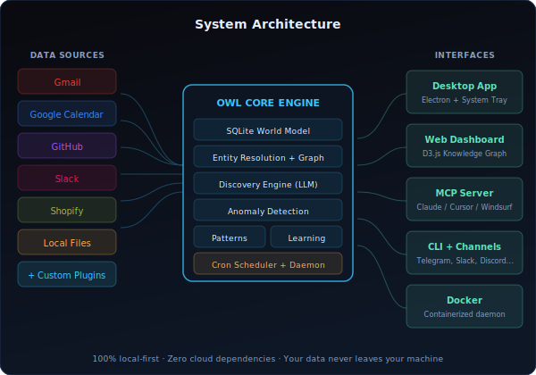
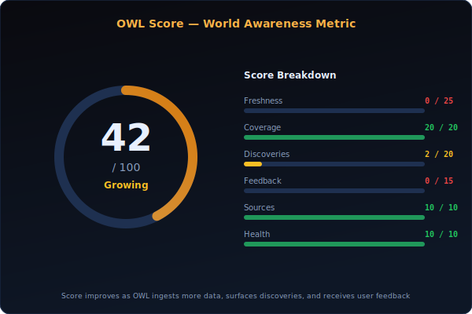
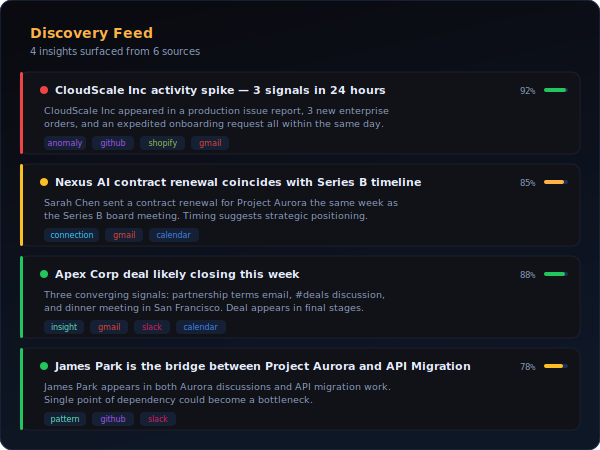
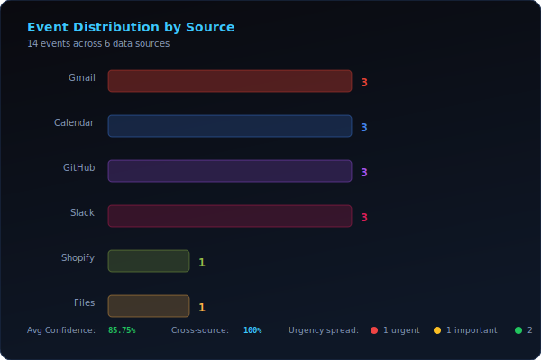

{.cover-image}

## Overview

OWL is a local-first autonomous AI daemon that watches your data sources — email, calendar, GitHub, Slack, Shopify, local files — builds a living world model in SQLite, and surfaces high-value discoveries through channels you already use. It is not a chatbot and not a dashboard. It is a quiet analyst that speaks first only when something matters.

I architected the entire system from scratch in Node.js: the daemon, the plugin system, the discovery engine, the knowledge graph, the web dashboard, the Electron desktop app, the MCP server, and the Docker deployment. Over 8,000 lines of production code, 98 passing tests, and 5 distinct ways to run it.

## What I Built

- **Core engine** — SQLite world model with entities, relationships, events, patterns, situations, and discoveries. Two-tier entity extraction (regex + LLM) with fuzzy resolution.
- **Discovery engine** — Three scan types (quick/deep/daily) with aggressive quality filtering, cross-source correlation detection, statistical anomaly detection, and discovery chaining with meta-insight generation.
- **Plugin system** — 7 built-in data source plugins (Gmail, Calendar, GitHub, Slack, Shopify, Files, Mock) with a simple contract any developer can implement in a day.
- **8 delivery channels** — CLI, Telegram, Slack, Discord, email digest, webhook, RSS/Atom, and WhatsApp. Each with retry queues, rich formatting, and conversational follow-up.
- **Electron desktop app** — Frameless window with animated splash screen, native OS notifications, global hotkey (Ctrl+Shift+O), system tray with live discovery feed, window state persistence, launch-at-startup, and auto-reconnect on crash.
- **Web dashboard** — D3.js force-directed knowledge graph, live discovery feed with urgency colors, OWL Score gauge, event timeline, entity detail sidebar, and search/filter controls.
- **MCP server** — 11 Model Context Protocol tools so Claude Desktop, Cursor, or Windsurf can query your world model directly.
- **Docker deployment** — Single `docker compose up -d` to run the daemon and dashboard in a container.
- **`owl ask`** — Natural language queries against your entire knowledge graph using your configured LLM.
- **Learning feedback loop** — User reactions (via Telegram, Slack, or CLI) feed back into preference scoring. Discovery types the user values get boosted; ones they dismiss get dampened.

## Results / Impact

- 10 entity types with relationship graph traversal (paths, clusters, bridges, hubs)
- 98 passing tests across the entire codebase
- 4 discovery types with cross-source correlation (anomaly, connection, pattern, insight)
- 6 data source plugins with unified watch/query contract
- 8 delivery channels with rich formatting and conversational follow-up
- 5 deployment modes: CLI, Desktop, Dashboard, Docker, MCP
- Zero cloud dependencies — 100% local-first, all data stays on your machine
- Open source on GitHub with full documentation site

## Tech Stack

- Node.js, SQLite, Electron, D3.js, MCP (Model Context Protocol), Docker, ESM, LLM Integration (OpenAI/Anthropic/Ollama), Google OAuth, Cron Scheduling, System Services

## Architecture

The system is designed around a core daemon that runs on a cron schedule, with plugins feeding events in and channels pushing discoveries out.

::: {.viz-grid}
::: {.viz-card}

**System architecture.** Data flows from 7 plugin sources through the core engine (world model, entity resolution, discovery engine, anomaly detection) and out through 5 interface layers.
:::
::: {.viz-card}

**OWL Score.** A composite world-awareness metric (0-100) broken into 6 dimensions: freshness, coverage, discoveries, feedback, sources, and health. The score improves as OWL ingests more data and receives user feedback.
:::
:::

## Discovery Engine

OWL doesn't just collect data — it finds what matters. The discovery engine runs LLM-powered analysis across your entire world model, detecting patterns, anomalies, and connections that span multiple data sources.

::: {.viz-grid}
::: {.viz-card}

**Discovery feed.** Each insight is classified by type (anomaly, connection, pattern, insight), tagged with urgency, and traced back to its source signals. Confidence scores reflect cross-source corroboration.
:::
::: {.viz-card}

**Event distribution.** Events flow in from all connected sources and are processed through entity extraction, relationship mapping, and temporal correlation before feeding the discovery engine.
:::
:::

## Deliverables

- [GitHub Repository](https://github.com/msaule/owl)
- [Documentation Site](https://msaule.github.io/owl)
- [npm Package](https://www.npmjs.com/package/owl-ai)
