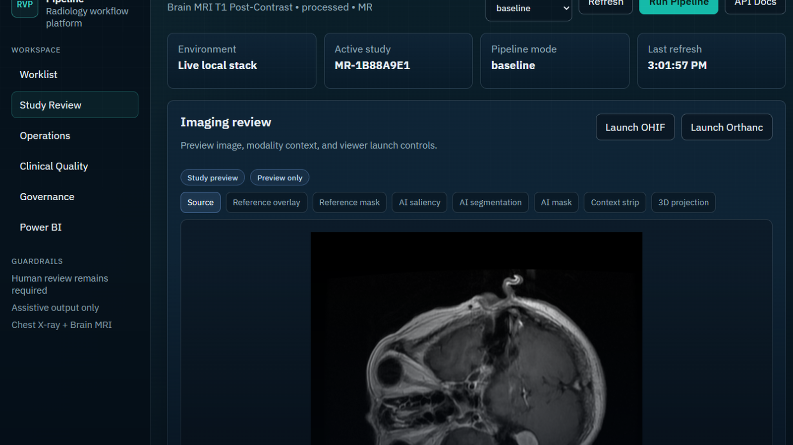{.cover-image}

::: {.callout-note}
Built as my flagship healthcare analytics and AI project: an end-to-end clinical workflow platform that shows not just model skill, but product judgment, governance discipline, database design, reporting maturity, and respect for human clinical accountability.
:::

## Portfolio Package

- [Full rendered project PDF](../files/radiology-value-pipeline/radiology_value_pipeline_mayo_portfolio.pdf)
- [Power BI dashboard export](../files/radiology-value-pipeline/RadiologyValuePipelineDashboard.pdf)
- [Operational SQL mart](../files/radiology-value-pipeline/sql/001_ops_dashboard.sql)
- [Clinical quality SQL mart](../files/radiology-value-pipeline/sql/002_quality_dashboard.sql)
- [Governance SQL mart](../files/radiology-value-pipeline/sql/003_governance_dashboard.sql)

```{=html}
<div class="mayo-hero-panel">
  <p><strong>Radiology Value Pipeline</strong> is a production-style MVP for a radiology workflow copilot. It is not a toy classifier and not an autonomous diagnostic product. It is an end-to-end platform skeleton that ingests imaging studies, runs modality-aware model pipelines, generates structured assistive outputs, captures human feedback, preserves audit and lineage, and publishes dashboard-ready operational, clinical quality, and governance data.</p>
  <p>The current build supports <strong>chest X-ray</strong> and <strong>brain MRI</strong> in the same workflow. Chest X-ray demonstrates high-throughput radiology operations. Brain MRI demonstrates advanced imaging AI, multi-class tumor phenotype classification, segmentation-backed localization, and a patient-level 3D corroboration path.</p>
</div>
```

::: {.callout-important}
This project is built around a strict clinical boundary: AI outputs are assistive suggestions only. There is no autonomous diagnosis, no auto-signing, and no unsupported clinical performance claim. The work is a technical platform demonstration, not a cleared medical device.
:::

## Executive Summary

Radiology Value Pipeline is my attempt to answer a practical question: what would a serious, human-centered radiology AI platform look like if it were designed around value, auditability, and clinician trust from day one?

The answer is not a single model. It is a pipeline.

The system is a local-first modular monolith with a FastAPI backend, PostgreSQL operational database, DB-backed worker orchestration, browser review workspace, Power BI reporting package, model lineage, prompt lineage, governance snapshots, audit events, and feedback loops. The product is built to make the AI pipeline visible rather than magical.

The result is a credible foundation for a radiology workflow platform that can:

- Register chest X-ray and brain MRI studies.
- Preserve normalized metadata, retrieval references, artifacts, and lineage.
- Run ordered specialist model services and workflow agents.
- Store structured findings, urgency suggestions, report drafts, discrepancies, feedback, model runs, and audit records.
- Surface study-level review in a polished browser UI.
- Publish Power BI-ready exports and dashboards for operational, clinical quality, and governance reporting.
- Maintain a real-vs-stub boundary so the platform can evolve without pretending that all pieces are clinically validated.

```{=html}
<div class="mayo-metric-grid">
  <div class="mayo-metric"><strong>76</strong><span>processed demo studies</span></div>
  <div class="mayo-metric"><strong>50</strong><span>chest X-ray studies</span></div>
  <div class="mayo-metric"><strong>26</strong><span>brain MRI studies</span></div>
  <div class="mayo-metric"><strong>129</strong><span>candidate findings persisted</span></div>
  <div class="mayo-metric"><strong>858</strong><span>dashboard fact rows</span></div>
  <div class="mayo-metric"><strong>304</strong><span>workflow agent runs</span></div>
</div>
```

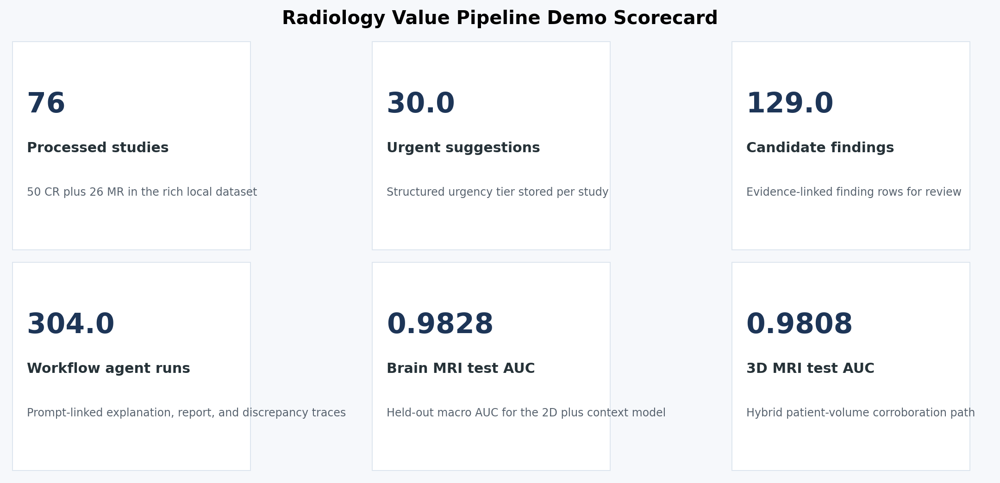{fig-alt="Portfolio scorecard showing processed studies, findings, reports, dashboard fact rows, and modality counts." width=100%}

## Why This Project Matters

This project is personal.

My father and his brother both died from cancer in their mid 40s, and poor or delayed diagnostic pathways were part of the story. I do not say that to claim a model would have saved them. I say it because diagnostic systems are human systems, and human systems need better memory, better feedback loops, better measurement, and better ways to reduce preventable misses.

Radiology is one of the places where this matters most. A radiologist is asked to move fast, read complex imaging, integrate clinical context, handle prior exams, manage interruptions, support urgent findings, and produce reports that downstream teams act on. The right AI system should not try to replace that expertise. It should make the workflow more inspectable, more measurable, and more resilient.

That is the motivation behind Radiology Value Pipeline:

- Help clinicians see candidate findings faster.
- Preserve uncertainty instead of hiding it.
- Track what the AI suggested, what the clinician accepted or rejected, and what changed later.
- Build governance into the workflow instead of bolting it on after deployment.
- Make performance visible by modality, site, subgroup, outcome, and time.

This is the kind of platform I would want to build around a real clinical team: technically ambitious, clinically humble, and designed to improve through feedback.

## Product Snapshot

Radiology Value Pipeline currently includes:

- A FastAPI backend with versioned APIs for studies, pipeline execution, findings, report drafts, feedback, final reports, discrepancy analysis, dashboards, and governance.
- A normalized PostgreSQL schema with UUID primary keys, JSONB raw payloads, append-only events, model and prompt version foreign keys, RLS-ready site scoping, and partition-ready append-heavy tables.
- A DB-backed worker pattern using row locking rather than a separate queue broker.
- A dual-mode ingestion architecture with a demo adapter and a DICOMweb-oriented Orthanc adapter contract.
- A chest X-ray model path based on ChestMNIST compact CNN ensembles.
- A brain MRI path based on the public Figshare Brain Tumor MRI benchmark, including context-aware slice classification, segmentation-backed localization, and patient-level 3D corroboration.
- A review UI that shows imaging preview, AI synthesis, model posture, target-level probabilities, draft report text, feedback controls, discrepancy events, audit trail, and workflow agent ledger.
- Power BI dashboard exports and a PBIP handoff package with operational, clinical quality, governance, model inventory, and agent lineage data.
- Documentation anchors including `agents.md`, `specifications.md`, architecture notes, ADRs, schema explainer, dashboard notes, API reference, and final validation notes.

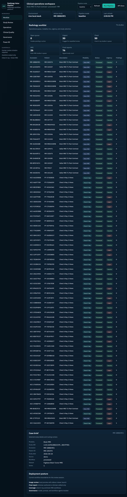{fig-alt="Radiology Value Pipeline browser workspace overview showing modality-aware worklist and dashboard panels." width=100%}

## The Design Choice That Defines The Project

The central architectural decision is that this is not a model demo. It is a workflow platform.

In healthcare AI, the hard parts are not only model architecture. The hard parts are versioning, traceability, feedback, governance, review experience, data contracts, operational monitoring, and making it possible for a clinician to understand what happened after the fact.

This platform treats every AI output as part of a governed workflow:

- The model run is stored.
- The model version is stored.
- The prompt version is stored when applicable.
- The parameters and raw output payload are stored.
- The structured output is stored separately from human-readable text.
- The clinician feedback is append-only.
- The final report remains clinician-authored or clinician-edited.
- The discrepancy analysis links AI output to the final report and downstream quality review.
- The dashboard marts expose adoption, override, drift, discrepancy, latency, and governance signals.

That design is what makes the project more than a classifier.

## Architecture

The MVP is intentionally a modular monolith plus worker. It avoids Kafka, event-sourcing theater, and microservice sprawl. Clean boundaries exist inside the repo, but the system stays comprehensible and runnable on a laptop.

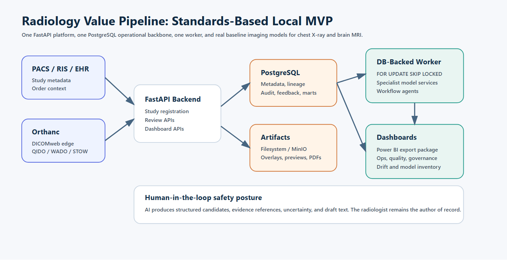{fig-alt="Platform architecture diagram showing FastAPI, PostgreSQL, worker, Orthanc, OHIF, artifact storage, MLflow, Evidently, and Power BI." width=100%}

### Runtime Architecture

```text
Browser review workspace
        |
        v
FastAPI backend
        |
        +-- Study registry and review APIs
        +-- Pipeline orchestration APIs
        +-- Feedback and discrepancy APIs
        +-- Dashboard and governance APIs
        |
        v
PostgreSQL operational backbone
        |
        +-- normalized study metadata
        +-- model and prompt versions
        +-- pipeline jobs
        +-- model runs
        +-- findings and urgency scores
        +-- report drafts and final reports
        +-- feedback and discrepancy events
        +-- audit and governance snapshots
        +-- dashboard marts
        |
        v
Worker process
        |
        +-- representation service
        +-- view quality service
        +-- abnormality detection service
        +-- urgency scoring service
        +-- prior context service
        +-- explanation service
        +-- report draft service
        +-- discrepancy service
        +-- workflow agents
```

### Why This Architecture Is Strong

This architecture is deliberately boring where reliability matters and advanced where imaging AI matters.

- FastAPI keeps the API layer typed, inspectable, and easy to document.
- PostgreSQL is the source of truth for operational state, not just an afterthought.
- The worker uses database row locking, which is enough for an MVP and avoids an unnecessary broker.
- Orthanc and OHIF are kept as standards-based DICOM and viewer integration points.
- MinIO or filesystem artifacts keep binary storage outside Postgres.
- MLflow and model version tables preserve model lineage.
- Prompt version tables preserve report-assist and agent lineage.
- Evidently-style drift snapshots create a path for scheduled monitoring.
- Power BI exports make the governance and operations story visible to leaders, not just engineers.

### Architectural Boundaries

| Area | Responsibility |
|---|---|
| `backend` | API routes, request validation, auth context, HTML review workspace |
| `services/ingestion` | Study registration, DICOM gateway abstraction, normalized envelopes |
| `services/pipeline` | Specialist model orchestration and output persistence |
| `services/reporting` | Draft rendering and discrepancy comparison |
| `services/feedback` | Append-only clinician feedback events |
| `services/governance` | Model, prompt, agent, drift, and governance surfaces |
| `services/dashboards` | Dashboard mart refresh and summary APIs |
| `workers` | DB-backed queue polling and background execution |
| `monitoring` | MLflow, Evidently, and lineage helpers |
| `dashboards` | SQL marts, Power BI package, and export scripts |

## Technology Stack

This stack was chosen for practical clinical product engineering, not novelty.

| Layer | Choice | Why it matters |
|---|---|---|
| API | FastAPI, Pydantic | Typed contracts, OpenAPI docs, predictable backend development |
| Database | PostgreSQL | Durable operational source of truth with JSONB, partitioning, RLS readiness, logical replication path |
| ORM and migrations | SQLAlchemy, Alembic | Explicit schema evolution and testable persistence |
| Imaging edge | Orthanc, DICOMweb | Standards-based DICOM edge rather than custom imaging APIs |
| Viewer | OHIF sidecar scaffold | Proven viewer integration path without premature custom extension work |
| Artifact storage | MinIO or filesystem abstraction | Keeps binaries outside Postgres and preserves local-first operation |
| Model lineage | MLflow | Registry, run metadata, artifact lineage, model tags |
| Drift | Evidently-style snapshots | Reference-vs-current monitoring model for input and output changes |
| Dashboards | SQL marts, CSV exports, Power BI PBIP | Executive and governance reporting path |
| Frontend | Server-rendered browser workspace with custom CSS and JS | Fast to iterate, easy to run locally, avoids overbuilding a separate frontend too early |
| Testing | pytest, smoke scripts | Contract and business-logic verification |

::: {.callout-note}
The stack is intentionally local-first. It can run with Docker Compose, but it also includes an embedded local PostgreSQL fallback so the product can still be demonstrated on a machine where Docker is unavailable.
:::

## Research-Backed Integration Choices

The project documentation captures current design-relevant research in `docs/architecture/research-notes.md`. The most important choices are:

- Use Orthanc DICOMweb and OHIF DICOMweb data source patterns rather than inventing proprietary imaging APIs.
- Keep Orthanc as the imaging edge and store normalized metadata plus retrieval references in the backend.
- Use MONAI Bundle concepts as the swappable model packaging contract.
- Keep MONAI Deploy packaging optional because packaging and runtime assumptions are more Linux and NVIDIA oriented.
- Treat MONAI Label as a future active-learning integration, not the runtime core for v1.
- Use PostgreSQL JSONB, RLS-ready site scoping, partitioning for append-heavy event tables, and logical replication readiness for future BI replicas.
- Use pgvector-ready columns for embeddings, while deferring ANN indexes until volume requires them.
- Prefer MLflow model aliases and tags over stage-centric workflows.
- Use prompt registry concepts for report-assist and agent lineage.
- Use Evidently-style reference-vs-current snapshots for drift.
- Use Power BI Import for historical marts and narrow DirectQuery only when operational freshness matters.
- Treat FDA AI-enabled device software lifecycle guidance and ONC HTI-1 predictive DSI transparency expectations as governance design inputs, not compliance claims.

## Repository Structure

```text
radiology-value-pipeline/
  backend/
    app/
      api/
      core/
      templates/
      static/
  db/
    migrations/
    models.py
    schema-explainer.md
  services/
    ingestion/
    pipeline/
    reporting/
    feedback/
    governance/
    dashboards/
  models/
    stub/
    baseline/
    monai_bundle/
  workers/
  monitoring/
  dashboards/
    sql/
    powerbi/
  docs/
    architecture/
    adrs/
  infra/
  scripts/
  tests/
  agents.md
  specifications.md
  README.md
```

The structure is designed to be legible to a reviewer. A hiring manager or technical interviewer can open the repository and immediately find the product specification, architecture decisions, database model, pipeline interfaces, worker behavior, dashboards, and tests.

## Data Model

PostgreSQL is the operational backbone. The platform does not store DICOM binaries in the relational database. It stores metadata, lineage, structured outputs, and retrieval references, while image artifacts, overlays, saliency maps, masks, and generated files live in artifact storage.

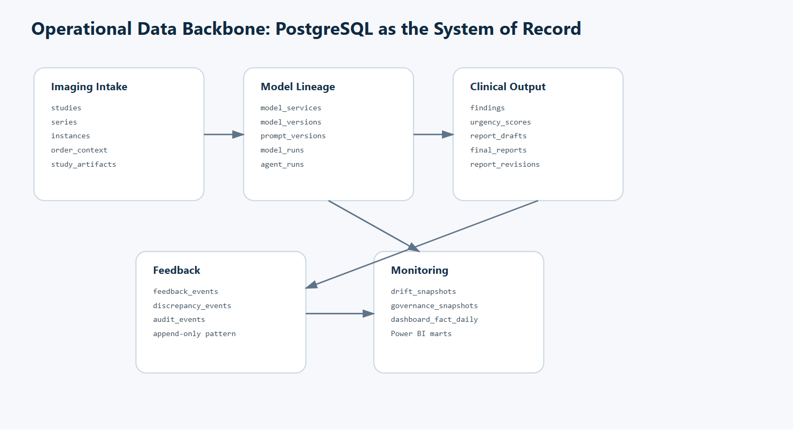{fig-alt="Simplified ERD showing studies, instances, model runs, findings, drafts, final reports, feedback, audit, governance, and dashboard facts." width=100%}

### Core Tables

| Table | Purpose |
|---|---|
| `studies` | Study-level identity, modality, accession, status, site, and metadata |
| `series` | Series-level normalized imaging metadata |
| `instances` | Instance-level SOP references and retrieval locators |
| `order_context` | Indication, reason for exam, ordering context |
| `study_artifacts` | Preview images, overlays, masks, saliency maps, exported artifacts |
| `pipeline_jobs` | DB-backed worker queue and job state |
| `model_services` | Registry of specialist services |
| `model_versions` | Model bundle, artifact, configuration, validation metadata |
| `prompt_versions` | Prompt lineage for report assist and workflow agents |
| `model_runs` | Per-service run metadata, latency, inputs, outputs, and errors |
| `findings` | Structured candidate findings with confidence and evidence refs |
| `urgency_scores` | Urgency suggestions and rationale |
| `report_drafts` | AI-generated draft findings and impression text |
| `final_reports` | Clinician-authored or clinician-edited final report text |
| `report_revisions` | Report change history |
| `discrepancy_events` | AI-vs-final and AI-vs-outcome discrepancy records |
| `feedback_events` | Append-only clinician feedback |
| `drift_snapshots` | Reference-vs-current monitoring records |
| `governance_snapshots` | Model and prompt governance records |
| `audit_events` | Security and workflow audit trail |
| `dashboard_fact_daily` | Curated daily dashboard fact table |
| `agent_runs` | Workflow agent execution lineage |
| `agent_versions` | Agent identity, prompt linkage, and active version metadata |

### Schema Principles

- UUID primary keys where durable identity matters.
- `created_at` and `updated_at` timestamps on operational entities.
- `event_date` on append-heavy tables for partitioning and dashboarding.
- `site_id` and role-scope columns where future RLS policies need them.
- Natural-key uniqueness on DICOM identifiers.
- JSONB for raw model payloads, drift details, prompt render context, and governance metadata.
- Vector-ready columns for study and report embeddings.
- Foreign keys from outputs to model versions and prompt versions.
- Append-only feedback and audit records.

### Example: DB-Backed Worker Claim

The worker is intentionally simple. It claims jobs with row-level locking and `SKIP LOCKED`, which gives safe concurrent polling without adding Redis or Kafka.

```sql
select *
from pipeline_jobs
where status = 'queued'
order by created_at asc
for update skip locked
limit 1;
```

This is an MVP-appropriate choice because the queue semantics are directly tied to the operational database, the failure modes are easy to inspect, and the system stays small enough to understand.

### Example: Dashboard Mart Shape

The dashboard marts are SQL-first. Power BI is a presentation layer, not a hidden source of truth.

```sql
select
  event_date,
  site_code,
  studies_registered,
  studies_processed,
  urgent_cases,
  failed_runs,
  latency_p50_ms,
  latency_p90_ms
from dashboard_ops_daily
order by event_date desc, site_code;
```

The exported SQL files are included with this write-up:

- [`001_ops_dashboard.sql`](../files/radiology-value-pipeline/sql/001_ops_dashboard.sql)
- [`002_quality_dashboard.sql`](../files/radiology-value-pipeline/sql/002_quality_dashboard.sql)
- [`003_governance_dashboard.sql`](../files/radiology-value-pipeline/sql/003_governance_dashboard.sql)

## Model System

The model system is orchestrated as specialist components, not a giant monolith. Each service has a typed contract, persists run metadata, records latency and status, and can run in stub or real mode.

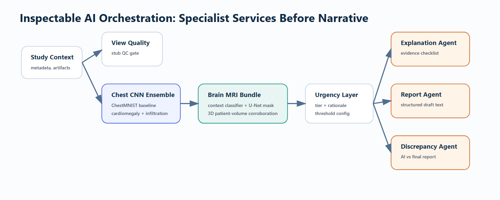{fig-alt="Model orchestration diagram showing specialist services and workflow agents." width=100%}

### Specialist Services

| Service | Role |
|---|---|
| `representation_service` | Creates or references imaging representation metadata |
| `view_quality_service` | Checks view and image quality assumptions |
| `abnormality_detection_service` | Produces target-level abnormality probabilities |
| `urgency_scoring_service` | Converts evidence into assistive urgency suggestions |
| `prior_context_service` | Attaches prior-context state |
| `explanation_service` | Produces saliency, evidence references, or explanation payloads |
| `report_draft_service` | Renders structured findings and concise draft text |
| `discrepancy_service` | Compares AI outputs with final report text |

### Workflow Agents

The platform also includes explicit workflow agents. These are not free-floating chatbots. They are governed workflow components with prompt versions, agent versions, input payloads, output payloads, status, latency, trace JSON, and audit linkage.

Current agent examples:

- `explanation_review_agent`
- `report_assist_agent`
- `discrepancy_review_agent`

The agent layer matters because modern clinical AI products will increasingly combine image models, structured rules, report drafting, and natural-language review. The platform makes those components observable rather than invisible.

## Model Performance

The project uses real public benchmark data where possible, while keeping strict language around clinical validation. The AUC values below are benchmark and demo evaluation metrics. They are not claims of clinical readiness.

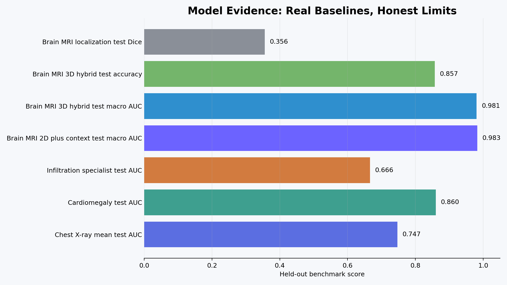{fig-alt="Model performance summary showing validation and test AUC for chest X-ray, infiltration, brain MRI, and 3D brain MRI paths." width=100%}

### Chest X-Ray Baseline

```{=html}
<div class="mayo-model-card">
  <p class="mayo-card-title">Chest X-ray abnormality baseline</p>
  <p><strong>Runtime bundle:</strong> compact-cnn-v4-ensemble-2</p>
  <p><strong>Dataset:</strong> ChestMNIST benchmark</p>
  <p><strong>Validation mean AUC:</strong> 0.7597</p>
  <p><strong>Held-out test mean AUC:</strong> 0.7470</p>
  <p><strong>Why it matters:</strong> this is a lightweight CPU-friendly baseline that can run locally and still produce real target-level probabilities, thresholds, and governance metadata.</p>
</div>
```

Chest X-ray is the operational MVP. It demonstrates the high-throughput workflow: study registration, model execution, findings, urgency suggestion, draft report support, feedback capture, discrepancy analysis, and dashboard publication.

Notable target results:

| Target | Validation AUC | Test AUC | Notes |
|---|---:|---:|---|
| Cardiomegaly | 0.8721 | 0.8601 | Stronger chest target in the current baseline |
| Infiltration baseline | 0.6473 | 0.6338 | Harder target with lower performance |
| Infiltration specialist | 0.6553 | 0.6658 | Specialist model improves the infiltration slice |

The system does not hide weak targets. It surfaces model posture and target-level metrics in the UI and governance data. That is an important product behavior: weaker model areas should be visible, not disguised behind a single aggregate score.

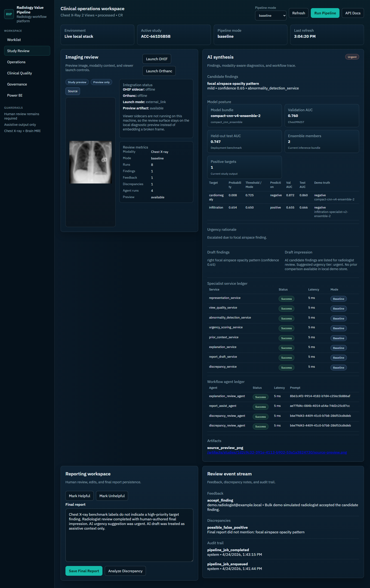{fig-alt="Chest X-ray study review showing imaging preview, AI synthesis, model posture, target probabilities, agent ledger, feedback, discrepancy, and audit trail." width=100%}

### Brain MRI Advanced Imaging Path

```{=html}
<div class="mayo-model-card">
  <p class="mayo-card-title">Brain MRI context and segmentation bundle</p>
  <p><strong>Runtime bundle:</strong> brain-mri-context-seg-v2</p>
  <p><strong>Dataset:</strong> public Figshare Brain Tumor MRI benchmark</p>
  <p><strong>Validation macro AUC:</strong> 0.9940</p>
  <p><strong>Held-out test macro AUC:</strong> 0.9828</p>
  <p><strong>Segmentation validation Dice:</strong> 0.3621</p>
  <p><strong>Segmentation held-out test Dice:</strong> 0.3556</p>
</div>
```

Brain MRI is the "advanced imaging AI" signal in the project. It shows that the platform can support more than 2D X-ray classification.

The current MRI path includes:

- Multi-class tumor phenotype classification.
- Context-aware slice classification.
- Segmentation-backed localization.
- Preview, mask, reference overlay, and saliency artifacts.
- Patient-level volumetric 3D corroboration.
- Modality-aware findings, urgency rationale, report draft text, and dashboard reporting.

Current brain MRI target results:

| Target | Test AUC |
|---|---:|
| Meningioma | 0.9787 |
| Glioma | 0.9831 |
| Pituitary | 0.9865 |
| Macro average | 0.9828 |

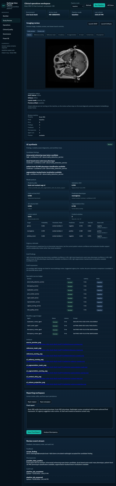{fig-alt="Brain MRI study review showing MRI preview, tumor classification targets, segmentation-backed artifacts, report assist output, and audit events." width=100%}

### Patient-Level 3D MRI Corroboration

```{=html}
<div class="mayo-model-card">
  <p class="mayo-card-title">Brain MRI patient-level 3D corroboration</p>
  <p><strong>Runtime bundle:</strong> brain-mri-volume3d-v1</p>
  <p><strong>Volume shape:</strong> 32 x 96 x 96</p>
  <p><strong>Hybrid validation macro AUC:</strong> 0.9941</p>
  <p><strong>Hybrid held-out test macro AUC:</strong> 0.9808</p>
  <p><strong>Validation accuracy:</strong> 0.9714</p>
  <p><strong>Held-out test accuracy:</strong> 0.8571</p>
</div>
```

The 3D path is valuable because it moves the MRI workflow beyond isolated 2D slices. A real neuroradiology workflow reasons across volumes and context. The current path stacks patient-level volumes from the public benchmark, trains a compact 3D model, and blends it with the stronger 2D context model for a hybrid corroboration score.

This is still not a multi-sequence BraTS-style workflow. It is, however, an important architectural proof that the same product can support:

- 2D high-throughput radiography.
- 2D context-aware MRI classification.
- Segmentation-backed localization.
- 3D patient-level corroboration.
- Shared governance, feedback, and dashboarding across modalities.

## Review Workspace

The browser review workspace is designed to feel like a clinical operations surface rather than a model demo page.

The study review page shows:

- Modality and accession context.
- Imaging preview and sidecar viewer launch controls.
- Clear OHIF and Orthanc status.
- Model bundle, validation AUC, test AUC, ensemble size, and target-level probabilities.
- Candidate findings with body region, severity, confidence, source service, status, and evidence references.
- Urgency rationale.
- Draft findings and impression text.
- Specialist service ledger.
- Workflow agent ledger.
- Artifact links.
- Reporting workspace for final report text.
- Feedback buttons.
- Discrepancy events.
- Audit trail.

The UI is intentionally explicit. If a sidecar service is offline, it says so. If an artifact is local, it shows the local fallback. If the AI is assistive only, the copy says so.

## Operations, Quality, and Governance Dashboards

Power BI is included because the product is not only for model builders. A radiology AI platform needs visibility for operations leaders, clinical quality teams, and governance committees.

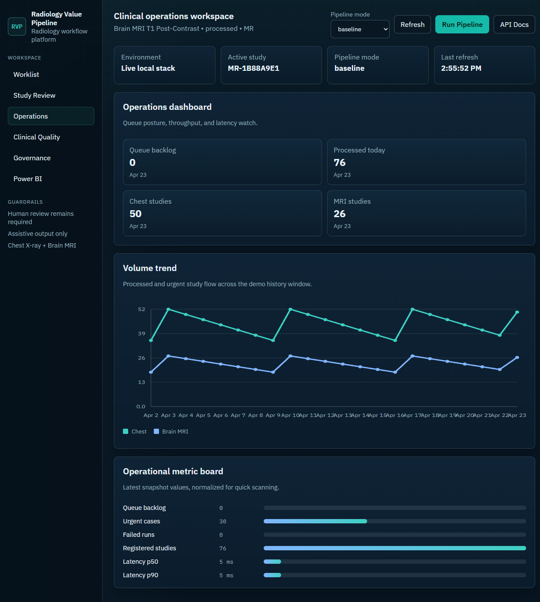{fig-alt="Web operations dashboard showing study volume, latency, urgency, and run health." width=100%}

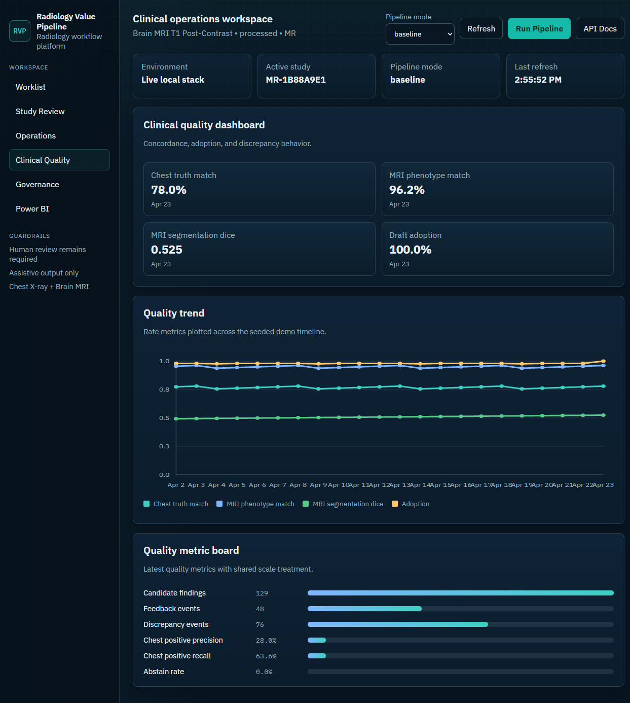{fig-alt="Web clinical quality dashboard showing discrepancy, feedback, adoption, and model quality metrics." width=100%}

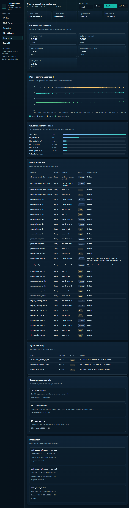{fig-alt="Web governance dashboard showing deployed models, prompts, drift, audit, and governance inventory." width=100%}

### Power BI Report Package

The Power BI package is designed around curated exports from dashboard marts. The report includes:

- Executive overview.
- Operational volume and latency.
- Clinical quality and model performance.
- Governance inventory and drift posture.
- Model and agent lineage.

The project includes a PBIP handoff package, CSV exports, and a browser download surface.

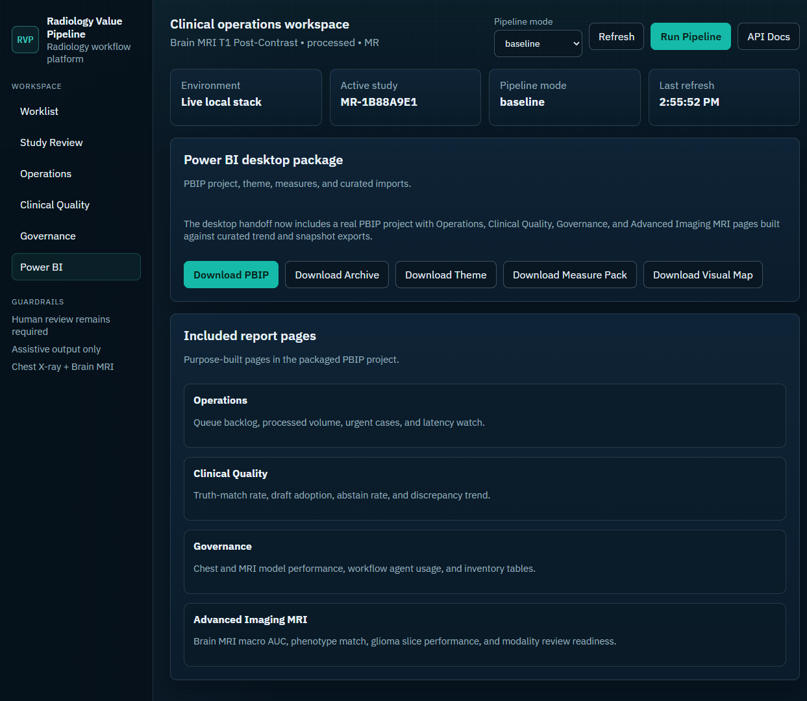{fig-alt="Power BI handoff page with packaged downloads and export status." width=100%}

### Embedded Power BI Export

The exported Power BI PDF is embedded below for HTML renderers that support PDF objects. The individual pages are also extracted as PNG images for portability.

```{=html}
<object class="mayo-pdf-frame" data="../files/radiology-value-pipeline/RadiologyValuePipelineDashboard.pdf" type="application/pdf">
  <p>Open the exported Power BI PDF at <a href="../files/radiology-value-pipeline/RadiologyValuePipelineDashboard.pdf">../files/radiology-value-pipeline/RadiologyValuePipelineDashboard.pdf</a>.</p>
</object>
```

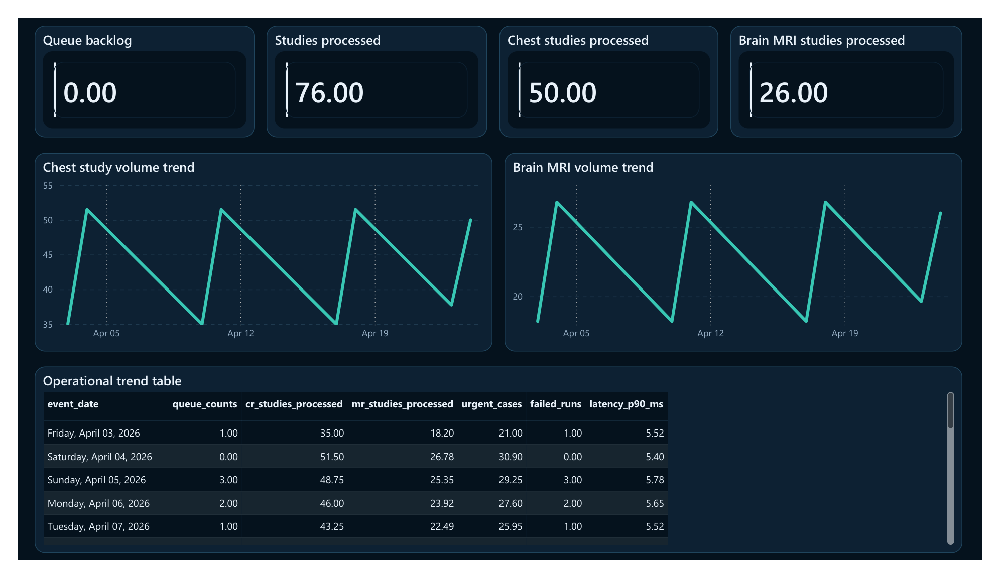{fig-alt="Power BI dashboard page 1." width=100%}

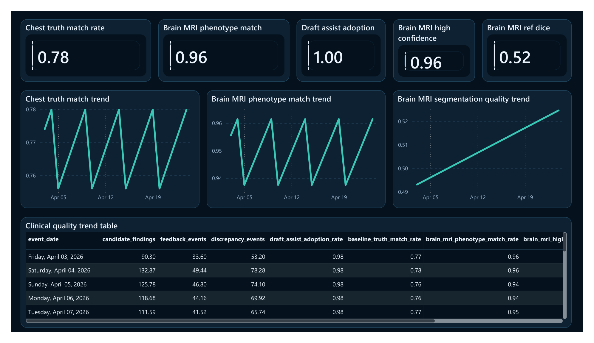{fig-alt="Power BI dashboard page 2." width=100%}

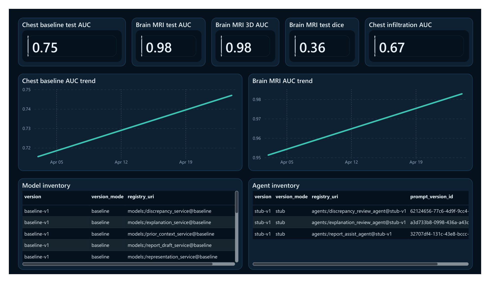{fig-alt="Power BI dashboard page 3." width=100%}

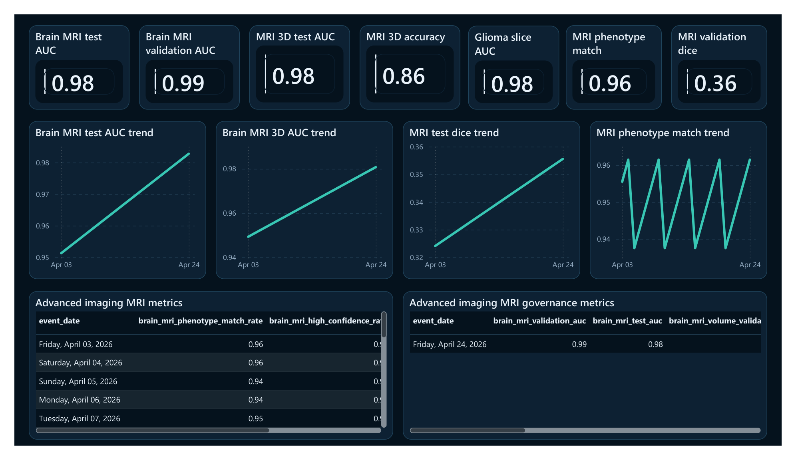{fig-alt="Power BI dashboard page 4." width=100%}

## What Makes This Portfolio Project Different

Many AI portfolio projects stop at a notebook. This one builds the product shell around the model.

The work demonstrates:

- Platform architecture, not just experimentation.
- Real database modeling with lineage and governance entities.
- Worker orchestration without distributed complexity.
- Multi-modality support across chest X-ray and brain MRI.
- Real benchmark-trained models where the project needs credibility.
- Browser review workflow with human feedback and discrepancy handling.
- Power BI reporting for operations, quality, and governance.
- Auditability and versioning as first-class features.
- A clear boundary between real model components and scaffolded future integrations.

This is the difference between "I trained a model" and "I understand what it takes to make imaging AI useful inside a clinical workflow."

## Clinical Workflow Design

The platform follows a human-in-the-loop path:

1. A study is registered from a DICOM gateway or demo adapter.
2. The study metadata, series, instances, order context, and artifact references are persisted.
3. A pipeline job is enqueued.
4. The worker runs ordered specialist services.
5. Structured findings and urgency suggestions are persisted.
6. A draft report is rendered from structured findings.
7. A clinician reviews the study and AI suggestions.
8. Feedback is recorded as append-only events.
9. A final report is saved as clinician-authored or clinician-edited text.
10. Discrepancy analysis compares AI outputs with the final report.
11. Dashboard marts expose adoption, latency, override, discrepancy, drift, and governance signals.

This workflow avoids the most dangerous pattern in medical AI demos: producing a confident paragraph with no lineage, no feedback, no uncertainty, and no accountability.

## Report Assist Design

The report assist layer does not merely output a free-form paragraph. It produces structured data first and text second.

Canonical finding shape:

```json
{
  "body_region": "right lung",
  "finding_name": "focal airspace opacity pattern",
  "laterality": "right",
  "severity": "mild",
  "confidence": 0.65,
  "evidence_ref": "source_preview_png",
  "source_service": "abnormality_detection_service",
  "status": "candidate",
  "uncertainty_flag": false,
  "abstain_reason": null
}
```

Draft text is then generated from the structured payload:

```text
Draft findings:
right focal airspace opacity pattern (confidence 0.65)

Draft impression:
AI candidate findings are listed for radiologist review.
Suggested urgency tier: urgent.
No prior comparison available in local demo store.
```

This structure is important because downstream systems can reason about a finding object, but they cannot safely reason about a free-form paragraph alone.

## Feedback Loop

Feedback is append-only and typed. The system supports:

- Accept finding.
- Reject finding.
- Edit finding.
- Override urgency.
- Mark helpful or unhelpful.
- Submit discrepancy note.
- Submit issue type such as false positive, false negative, bad localization, or hallucinated text.

This creates a learning system without pretending to retrain automatically. Feedback is stored as evidence for review, analytics, and future model improvement.

## Governance and Monitoring

The governance layer is one of the strongest parts of the project because it treats model deployment as an accountable lifecycle.

Governance snapshots store:

- Intended use.
- Modality.
- Supported populations and exclusions.
- Training data provenance.
- Validation summary.
- Known limitations.
- Rollback plan.
- Effective date.
- Deployment cohort.
- Threshold configuration.

Monitoring stores:

- Model lineage.
- Prompt lineage.
- Agent lineage.
- Latency.
- Drift summaries.
- Override rate.
- Abstain rate.
- Subgroup quality metrics.
- Unresolved incidents.
- Audit completeness.

This is directly aligned with the direction of modern clinical AI governance: transparency, versioning, real-world monitoring, and clear human accountability.

## API Surface

The API is intentionally simple and reviewable.

| Endpoint | Purpose |
|---|---|
| `GET /healthz` | Health check |
| `POST /studies/register` | Register study metadata |
| `GET /studies/{study_id}` | Retrieve study detail |
| `POST /studies/{study_id}/run-pipeline` | Enqueue or run model pipeline |
| `GET /studies/{study_id}/findings` | Retrieve structured findings |
| `GET /studies/{study_id}/report-draft` | Retrieve draft report payload |
| `POST /studies/{study_id}/feedback` | Record feedback |
| `POST /studies/{study_id}/final-report` | Save final report |
| `POST /studies/{study_id}/discrepancy/analyze` | Analyze discrepancy |
| `GET /studies/{study_id}/review-context` | Retrieve full UI review context |
| `GET /dashboards/ops` | Operational dashboard summary |
| `GET /dashboards/quality` | Clinical quality dashboard summary |
| `GET /dashboards/governance` | Governance dashboard summary |
| `GET /governance/models` | Model inventory |
| `GET /governance/agents` | Agent inventory |
| `GET /governance/drift` | Drift snapshot summary |

Example review context response shape:

```json
{
  "study": {
    "id": "1d2c9c32-391e-4113-b902-53a1a3824730",
    "modality": "CR",
    "description": "Chest X-Ray 2 Views",
    "status": "processed"
  },
  "model_posture": {
    "model_bundle": "compact-cnn-v4-ensemble-2",
    "validation_auc": 0.7597,
    "held_out_test_auc": 0.7470
  },
  "findings": [],
  "urgency": {},
  "draft_report": {},
  "agent_runs": [],
  "audit_events": []
}
```

## Security and Privacy Posture

The MVP is local-first and privacy-safe by default:

- No PHI is required for the demo path.
- Synthetic and public benchmark data are used for demonstration.
- DICOM binaries are not stored in Postgres.
- Study artifacts are stored in MinIO or filesystem abstraction.
- Site scoping is included for future RLS.
- Local auth headers are scaffolded but enterprise identity is deferred.
- Audit events record key workflow actions.
- The system does not make clinical deployment claims.

## What Is Real vs Stubbed

The project is honest about maturity.

| Area | Current state |
|---|---|
| Study registration | Real local workflow and API |
| PostgreSQL schema | Real migrations and models |
| Worker orchestration | Real DB-backed queue pattern |
| Chest X-ray model | Real ChestMNIST compact CNN ensemble baseline |
| Infiltration specialist | Real target-specific baseline improvement |
| Brain MRI model | Real public Figshare benchmark model path |
| Brain MRI 3D corroboration | Real patient-level stacked-volume model path |
| Findings persistence | Real structured persistence |
| Draft report rendering | Real deterministic renderer, not a clinical LLM |
| Feedback events | Real append-only persistence |
| Discrepancy analysis | Simplified deterministic comparison |
| Governance snapshots | Real tables and surfaces, benchmark-scoped values |
| Drift snapshots | Scaffolded and demo-populated |
| OHIF integration | Sidecar and launch contract, deep embedding deferred |
| Orthanc integration | DICOMweb adapter contract, live sidecar depends on Docker |
| Enterprise identity | Deferred |
| Clinical validation | Not performed |

## What I Want A Clinical Engineering Team To Notice

I built this project to show how I think about clinical software, not just how I train a model.

The model matters, but the system around the model matters just as much. In a real radiology setting, a good prediction is only useful if the team can see where it came from, understand what version produced it, review the evidence, correct it, audit it later, and measure whether it helped or hurt the workflow.

That is why I put so much weight on the parts that are often missing from AI demos:

- The radiologist remains the author of record.
- AI outputs are stored as structured candidates, not as untraceable narrative.
- Every run links back to a model version, prompt version, input payload, output payload, and audit record.
- Feedback and discrepancies are preserved instead of being treated as one-off UI actions.
- Dashboards are built from SQL marts so operational, quality, and governance questions can be answered outside the application.
- The architecture stays simple enough for another engineer to inherit.

What I want a reviewer to see is that I care about the whole product surface: the imaging edge, the database, the model contracts, the review workflow, the reporting layer, the failure modes, and the documentation. I did not want this to be a notebook that looks impressive for five minutes. I wanted it to feel like the beginning of a system a serious team could critique, extend, and eventually harden.

## How I Would Walk A Reviewer Through It

If we were walking through the repository together, I would start with the workflow instead of the model. I would show how a study enters the system, how the pipeline job is created, how each specialist service writes a run record, and how the review page makes the model output inspectable.

Then I would show the database. That is where the project becomes more than a demo. The schema captures studies, model versions, prompt versions, model runs, findings, urgency scores, report drafts, final reports, feedback, discrepancies, audit events, governance snapshots, drift snapshots, and dashboard facts. It is designed so a clinical team can ask: what happened, who reviewed it, what changed, and how often is this pattern occurring?

After that I would show the two imaging paths. Chest X-ray demonstrates the high-throughput workflow and the practical challenge of weaker targets like infiltration. Brain MRI demonstrates the more advanced imaging path: multi-class tumor phenotype classification, segmentation-backed localization, and a patient-level 3D corroboration model. I would be explicit that these are benchmark-trained models and not clinically validated devices.

Finally, I would show the dashboards and governance surfaces. My goal there was to make the product legible to more than one audience. Engineers can inspect runs and versions. Clinicians can review findings and feedback. Operations leaders can see throughput and latency. Governance reviewers can see model inventory, prompts, drift records, limitations, and audit completeness.

## Next Milestones

The next serious increments would be:

1. Harden DICOM ingestion against a live Orthanc instance and test OHIF launch URLs with real DICOMweb studies.
2. Replace selected deterministic services with stronger MONAI Bundle-backed implementations.
3. Add a richer BraTS-style multi-sequence MRI path with volumetric segmentation and clinically meaningful MRI report structure.
4. Add calibrated uncertainty, abstention thresholds, and subgroup-level evaluation.
5. Add stronger NLP discrepancy analysis with explicit prompt governance and human review.
6. Expand identity from local headers to enterprise SSO.
7. Add scheduled drift jobs and alert review workflows.
8. Add a read replica or export pipeline for larger Power BI deployments.
9. Run a silent-mode evaluation against de-identified retrospective cases under appropriate governance.

## Local Run Path

The repo includes a one-command local path:

```powershell
powershell -ExecutionPolicy Bypass -File scripts/start_local_mvp.ps1
```

For the already-seeded local environment, the fast path is:

```powershell
powershell -ExecutionPolicy Bypass -File scripts/start_local_mvp.ps1 -SkipSeed -SkipDemo
```

Then open:

```text
http://127.0.0.1:8000/
```

API docs:

```text
http://127.0.0.1:8000/docs
```

## Appendix: Dashboard Data Export Shape

The Power BI package consumes curated exports such as:

```text
dashboards/powerbi/exports/ops_snapshot.csv
dashboards/powerbi/exports/quality_snapshot.csv
dashboards/powerbi/exports/governance_snapshot_latest.csv
dashboards/powerbi/exports/ops_trend.csv
dashboards/powerbi/exports/quality_trend.csv
dashboards/powerbi/exports/governance_trend.csv
dashboards/powerbi/exports/model_versions.csv
dashboards/powerbi/exports/agent_versions.csv
dashboards/powerbi/exports/agent_runs.csv
```

This makes the handoff portable. A reviewer can understand the dashboard model even without connecting to the local PostgreSQL database.

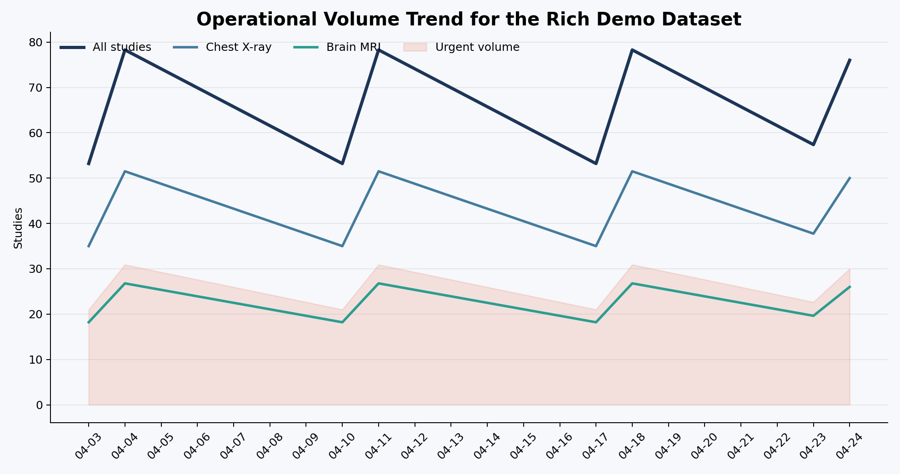{fig-alt="Operational volume trend chart showing chest X-ray and brain MRI processed over time." width=100%}

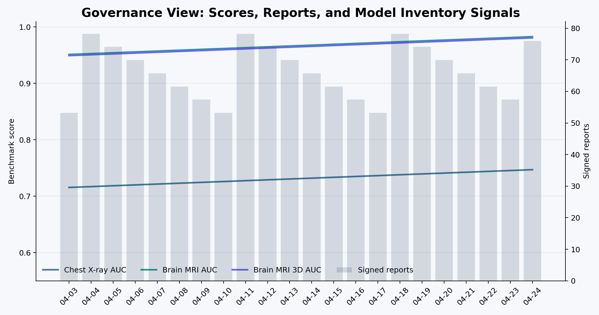{fig-alt="Governance score trend chart showing model and agent lineage over time." width=100%}

## Appendix: SQL Mart Excerpts

Operational dashboard:

```sql
select
  event_date,
  site_code,
  queue_counts,
  studies_registered,
  studies_processed,
  urgent_cases,
  failed_runs,
  latency_p50_ms,
  latency_p90_ms
from dashboard_ops_daily;
```

Clinical quality dashboard:

```sql
select
  event_date,
  site_code,
  candidate_findings,
  feedback_events,
  helpful_feedback_rate,
  discrepancy_events,
  draft_assist_adoption_rate,
  abstain_rate,
  baseline_truth_match_rate,
  baseline_positive_recall_rate,
  baseline_positive_precision_rate
from dashboard_quality_daily;
```

Governance dashboard:

```sql
select
  event_date,
  site_code,
  governance_snapshots,
  baseline_runs,
  agent_runs,
  signed_reports,
  unhelpful_feedback,
  baseline_validation_auc,
  baseline_test_auc,
  infiltration_specialist_test_auc,
  infiltration_specialist_gain_auc
from dashboard_governance_daily;
```

## Appendix: Product Boundaries

This project is meant to be impressive because it is disciplined.

It does not claim:

- FDA clearance.
- Clinical deployment readiness.
- Replacement of radiologists.
- Autonomous diagnosis.
- Real hospital integration.
- Production security hardening.
- Prospective clinical validation.

It does claim:

- A serious architecture for radiology workflow AI.
- Real local execution.
- Real schema design.
- Real model lineage and governance surfaces.
- Real benchmark-trained model paths.
- Real browser review workflow.
- Real Power BI reporting handoff.
- A credible path from portfolio MVP to clinical engineering platform.

## Closing

I built Radiology Value Pipeline because radiology AI should be measured by more than a model score. It should be measured by whether it can fit into real clinical work, preserve accountability, learn from feedback, and make diagnostic systems more reliable over time.

That is the project I wanted to show: a platform that respects the clinician, respects the patient, and treats AI as one part of a larger care-delivery system.
