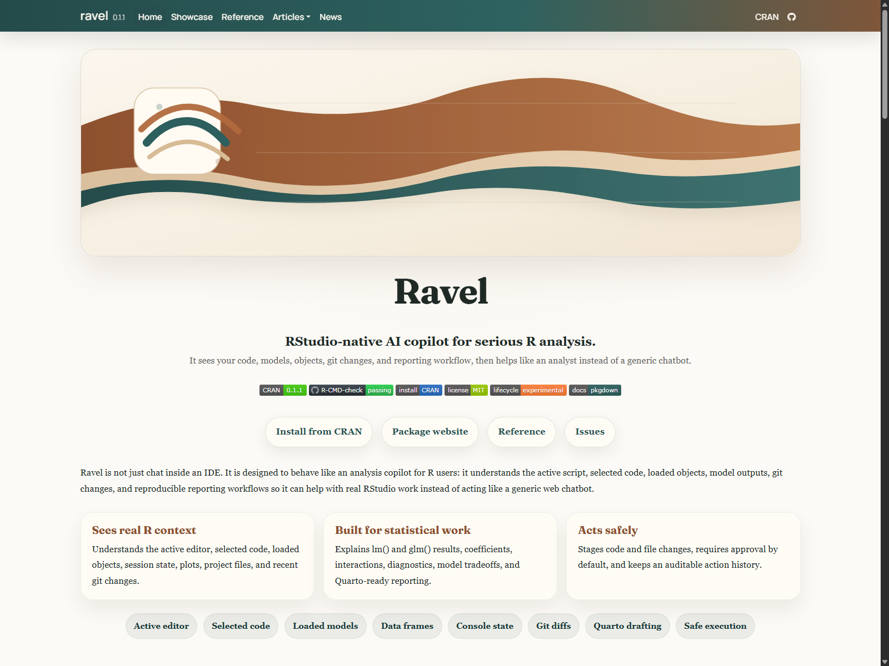
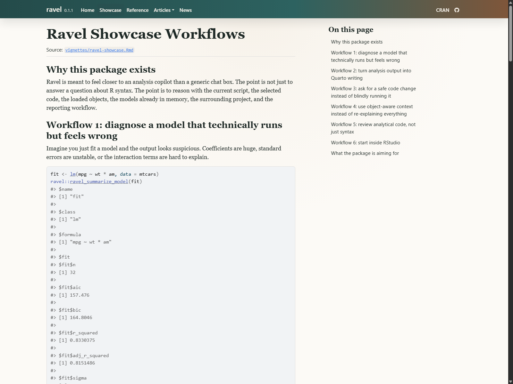
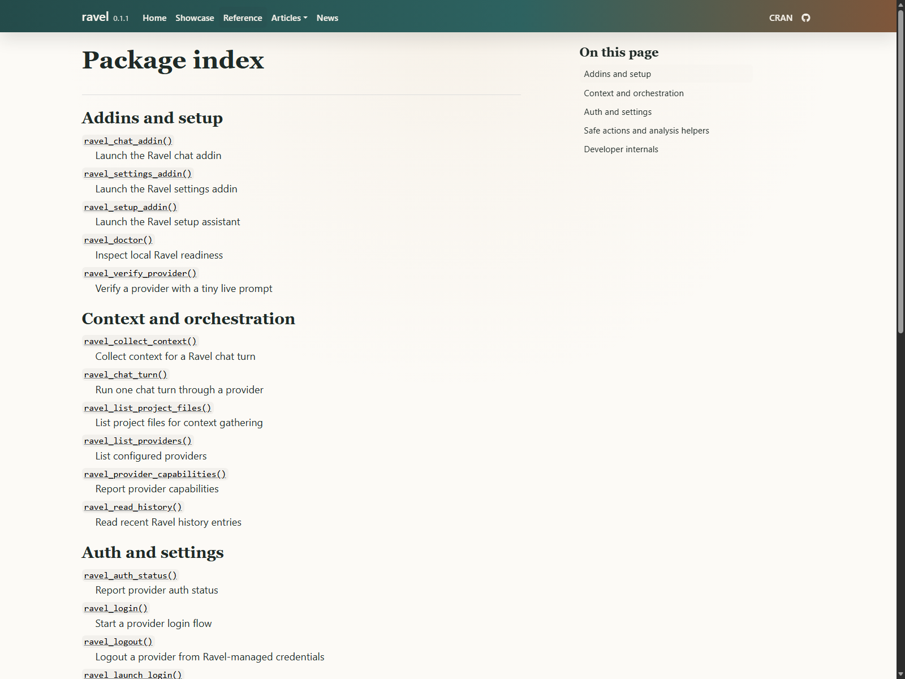

{.cover-image}

::: {.hero-actions}
[CRAN Package](https://cran.r-project.org/package=ravel){.btn-primary target="_blank" rel="noopener"}
[Package Website](https://msaule.github.io/ravel/){.btn-ghost target="_blank" rel="noopener"}
[GitHub Repo](https://github.com/msaule/ravel){.btn-ghost target="_blank" rel="noopener"}
[Reference Docs](https://msaule.github.io/ravel/reference/){.btn-ghost target="_blank" rel="noopener"}
:::

## Overview

Ravel is a CRAN-published R package that brings an AI copilot directly into RStudio and Posit-style analysis workflows. The goal was not to build a generic chat wrapper. The goal was to build a serious analyst companion that understands the surrounding project context: active editor code, selected snippets, loaded objects, console output, plots, git state, package structure, and reporting workflow.

The package is designed for practical analysis work. It can help explain code, debug analysis problems, interpret models, compare modeling choices, draft Quarto sections, and stage file or code actions for review before anything is applied.

## Latest Release: 0.1.2 Accepted on CRAN

The latest accepted maintenance update moves Ravel further from "chat box" and closer to a real RStudio-native analysis agent. Version 0.1.2 refreshed provider defaults, added OpenAI Responses API support, introduced remote MCP tool declarations, and tightened file-action safety so approved writes outside the detected project root are blocked unless explicitly allowed.

That update matters because Ravel is built around trust: providers should use official APIs or CLIs, actions should be auditable, and generated code should never quietly mutate a project. The release also passed the full GitHub Actions matrix across Windows, macOS, Ubuntu release, and Ubuntu devel, with release assets attached on GitHub.

## What I Built

- Built an installable R package with RStudio addins for setup, chat, settings, and workflow support.
- Integrated context-aware helpers for active editor contents, selected code, workspace objects, console output, plots, project files, package metadata, and git state.
- Added multi-provider support through official APIs and CLIs, including OpenAI, Gemini, GitHub Copilot CLI, and Anthropic-oriented provider architecture.
- Modernized the OpenAI API path around the Responses API and added remote MCP tool declarations for provider-supported tool ecosystems.
- Designed safe staged actions so code and file operations are previewed before execution instead of silently modifying a project.
- Added project-root safety checks so even approved file writes outside the detected project are blocked by default.
- Added model interpretation helpers for common `lm()` and `glm()` workflows.
- Built Quarto drafting support for methods, results, diagnostics, and interpretation sections.
- Published documentation with pkgdown and maintained a CRAN-ready release process with cross-platform checks.

## CRAN Release Discipline

The most important part of this project is that it passed the packaging bar. Ravel was accepted on CRAN, which means it is installable through the normal R ecosystem:

```r
install.packages("ravel")
library(ravel)
ravel::ravel_setup_addin()
```

The CRAN submission work required more than making the package run locally. I tightened software references in `DESCRIPTION`, avoided writing settings or history to user home filespace by default, moved code execution away from `.GlobalEnv` unless explicitly requested, and ensured network-backed providers are not contacted in examples or tests. The package checks reported 0 errors, 0 warnings, and 1 note across the submitted release process.

The 0.1.2 update kept that same discipline: no new required dependencies for MCP, no network-backed examples or tests, no default writes into the user's home filespace, and no hidden execution path.

## Interface and Documentation

::: {.viz-grid}
::: {.viz-card}

<strong>Pkgdown homepage.</strong> The public documentation presents the package value proposition, installation path, CRAN status, and core workflows.
:::

::: {.viz-card}

<strong>Workflow showcase.</strong> The articles explain how Ravel fits into active RStudio analysis rather than acting as a detached chat window.
:::

::: {.viz-card}

<strong>Reference index.</strong> The exported API is documented for setup, provider configuration, context collection, action staging, and analysis support.
:::
:::

## Results/Impact

- Published a real R package to CRAN under the `ravel` package name.
- Made installation available through the standard R command `install.packages("ravel")`.
- Shipped and had accepted a 0.1.2 maintenance update with OpenAI Responses API support, remote MCP declarations, and stronger file-write guardrails.
- Built the package around analyst trust: context collection is explicit, actions are staged, and execution paths are designed to avoid reckless project modification.
- Created a foundation for AI-assisted statistical analysis that respects RStudio workflows, package development norms, Quarto reporting, and reproducibility.
- Maintained public documentation and GitHub infrastructure so the package can be inspected, installed, tested, and extended.

## Tech Stack

- R package development: R, roxygen2, testthat, pkgdown, GitHub Actions
- RStudio integration: rstudioapi, Shiny, miniUI
- Provider integration: httr2, jsonlite, official provider APIs and CLIs
- Tooling direction: OpenAI Responses API, remote MCP declarations, provider capability metadata
- Analysis support: model interpretation helpers, workspace inspection, Quarto drafting, staged code/file actions
- Release workflow: CRAN submission, cross-platform R CMD check, package documentation, release assets

## Deliverables

- [CRAN package page](https://cran.r-project.org/package=ravel){target="_blank" rel="noopener"}
- [Package website](https://msaule.github.io/ravel/){target="_blank" rel="noopener"}
- [GitHub repository](https://github.com/msaule/ravel){target="_blank" rel="noopener"}
- [GitHub release v0.1.2](https://github.com/msaule/ravel/releases/tag/v0.1.2){target="_blank" rel="noopener"}
- [Reference documentation](https://msaule.github.io/ravel/reference/){target="_blank" rel="noopener"}
- [Showcase article](https://msaule.github.io/ravel/articles/ravel-showcase.html){target="_blank" rel="noopener"}

