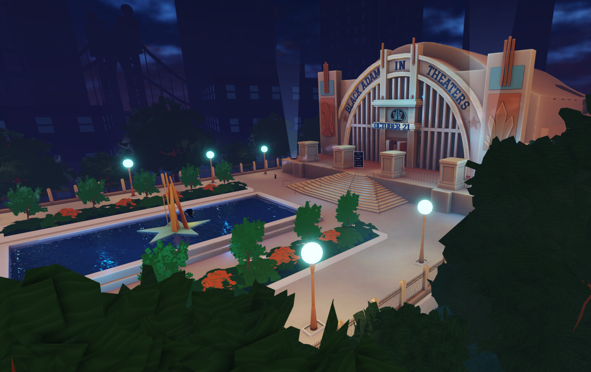
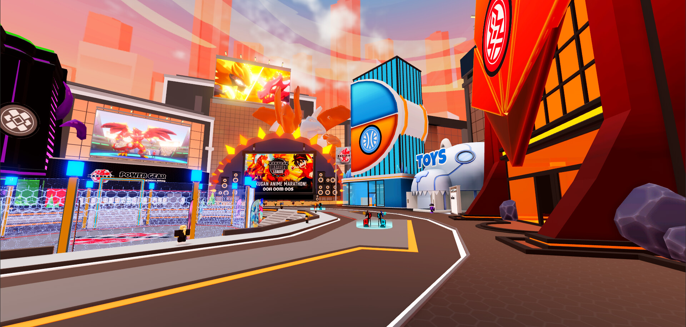
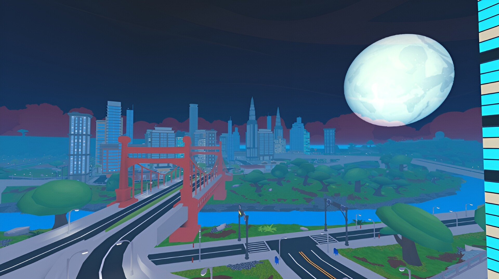
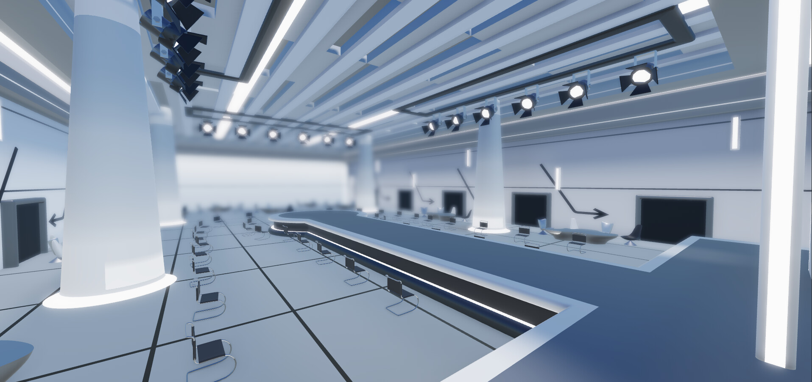

{.cover-image}

## Overview

I have been building on Roblox for 10 years. Before this portfolio became mostly analytics and machine learning, a lot of my work was shipped 3D worlds. Across the games and brand experiences I contributed to, those places add up to 6.5B+ place visits.

I worked as a world designer, 3D artist, environment artist, texture artist, builder, and Roblox DevRel QA tester. I built environments, vehicles, terrain, city layouts, props, interior spaces, lobby redesigns, expansion areas, and branded worlds for games and campaigns tied to major entertainment and consumer brands.

A lot of this happened when Roblox brand activations were still early. I worked on projects connected to Warner Music, Sony Entertainment, DC's Black Adam, Bakugan, L'Oreal, JDRF, and other large IP campaigns. I was also personally commended by Roblox CEO David Baszucki for my work during the early interactive concert era on Roblox, including the Ava Max launch-party period.

The simple version: I learned how to build digital places that millions of people could enter, understand, move through, and remember.

## What I Worked On

- Built 3D environments, terrain, props, vehicles, background buildings, and world layouts for live Roblox games.
- Helped create branded event spaces for music, film, toy, beauty, nonprofit, and game IP.
- Worked on the Black Adam Roblox event as the main 3D world build lead for the Justice Hall area and surrounding environment.
- Built assets and lobby/world elements for Bakugan Battle League.
- Created 30+ vehicles for Anomic's revamp.
- Built stylized props and expansion environments for Spirit Guides.
- Helped create the main world and supporting environments for JDRF One World.
- Helped bring the Ava Max Heaven and Hell launch-party map to life, including the dominant Heaven and Hell environments, props, and catalog assets.

## Visual Work

::: {.viz-grid}
::: {.viz-card}

<strong>Bakugan Battle League.</strong> A branded lobby/world environment built around a global toy and entertainment franchise.
:::

::: {.viz-card}

<strong>City-scale world design.</strong> Large environment work with roads, landmarks, atmosphere, terrain, and readable player paths.
:::

::: {.viz-card}

<strong>Interior production.</strong> A clean sci-fi environment focused on lighting, spacing, scale, and mood.
:::
:::

## Selected Work

**Dreamworld RP**  
3D Artist for Cosmow from December 2023 to February 2024. I helped develop Dreamworld RP from the base up: terrain environments, background buildings, nature props, world population, and vehicles.

**Spirit Guides**  
3D Environment Artist from November 2022 to September 2023. I created stylized world props, modified existing environments, and built new environment pieces for expansion updates.

**Black Adam Event**  
3D World Build Lead from September 2022 to October 2022. I built the Justice Hall area and surrounding environment for the main Roblox promotional event tied to the movie.

**Bakugan Battle League**  
3D Modeler and World Build from May 2022 to July 2022. I created building assets and supported a full lobby redesign for a major global toy brand.

**Infinite Canvas**  
3D Artist from February 2022 to September 2022. I helped with 3D assets, animal rigs, and outsourced Roblox projects, including creator-led collaborations.

**Anomic**  
3D Artist from May 2021 to March 2022. I created 30+ vehicles for the game's revamp.

**Specter**  
3D Artist from March 2021 to April 2021. I created new ghost models as part of a larger creature revamp.

**JDRF One World**  
3D Artist and Environment Artist from September 2020 to October 2020. I built the main world environment, props, and multiple supporting environments for the client's virtual walk concept.

**Ava Max Heaven and Hell Launch Party**  
Environment Artist and 3D Modeler from August 2020 to September 2020. I helped shape the map design and built major Heaven and Hell environments, prop models, and catalog assets for one of Roblox's early music launch-party experiences.

## How I Thought About The Work

Roblox worlds punish weak design fast. Players do not stop to read a manual. They spawn in, look around, and decide almost immediately if the place makes sense.

That meant the environment had to do a lot of work:

- The first view had to tell players where they were.
- Roads, bridges, buildings, lights, and landmarks had to guide movement without overexplaining.
- Branded areas had to feel big without becoming confusing.
- Assets had to look good while still running on lower-end devices.
- Event spaces had to support crowds, screenshots, social movement, and timed moments.
- Client ideas had to become actual places people could use.

That is the part I am proud of. I was not just making objects. I was building the shape of the experience.

## Results/Impact

- Contributed to shipped Roblox experiences totaling 6.5B+ place visits.
- Worked on brand worlds and live-event environments connected to Warner Music, Sony Entertainment, DC/Black Adam, Bakugan, L'Oreal, JDRF, and other global projects.
- Helped build early Roblox music and brand activations before this category became normal across the platform.
- Created 30+ vehicles for Anomic and a large amount of environment work across roleplay, event, horror, nonprofit, and branded experiences.
- Personally commended by Roblox CEO David Baszucki for my work during the early interactive concert era on Roblox.

## Skills

- Roblox Studio
- 3D modeling, environment design, texture work, terrain, lighting, prop production
- World layout, player flow, landmark design, interior/exterior composition
- Performance-aware asset design for high-traffic Roblox experiences
- Brand translation from real-world IP into interactive spaces
- QA, launch readiness, client feedback, and production deadlines

## Public Context

These links are not a full list of my work, but they show the scale of the Roblox brand and music category I was building in:

- [Sony Music and Roblox partnership](https://www.sonymusic.com/sonymusic/roblox-partnership/)
- [Warner Music Group Roblox experience context](https://www.wmg.com/news/warner-music-group-announces-the-launch-of-rhythm-city-its-first-persistent-music-experience-on-roblox)
- [Bakugan Battle League Roblox event](https://bakugan.wiki/wiki/Bakugan_Battle_League_(Roblox))
- [L'Oreal metaverse/avatar context](https://www.loreal.com/en/press-release/group/loreal-partnership-with-metaverse-avatar-platform-ready-player-me/)
