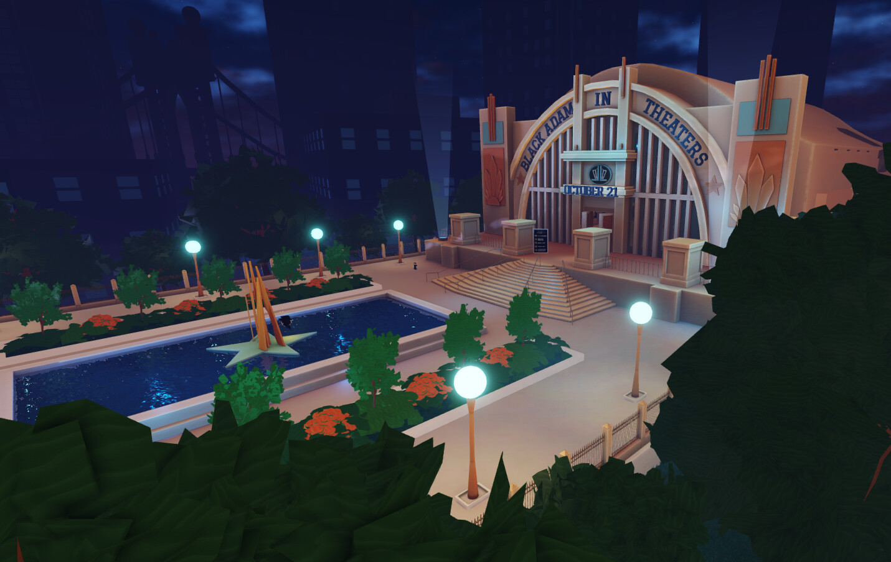
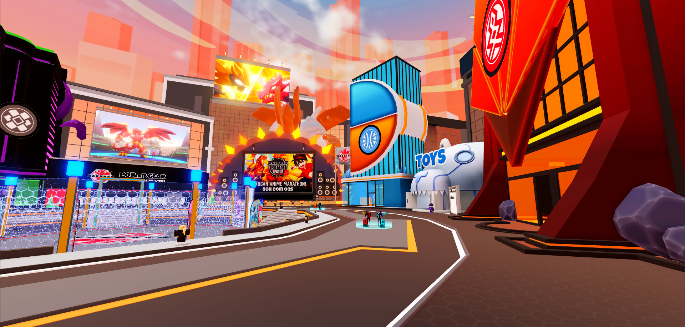
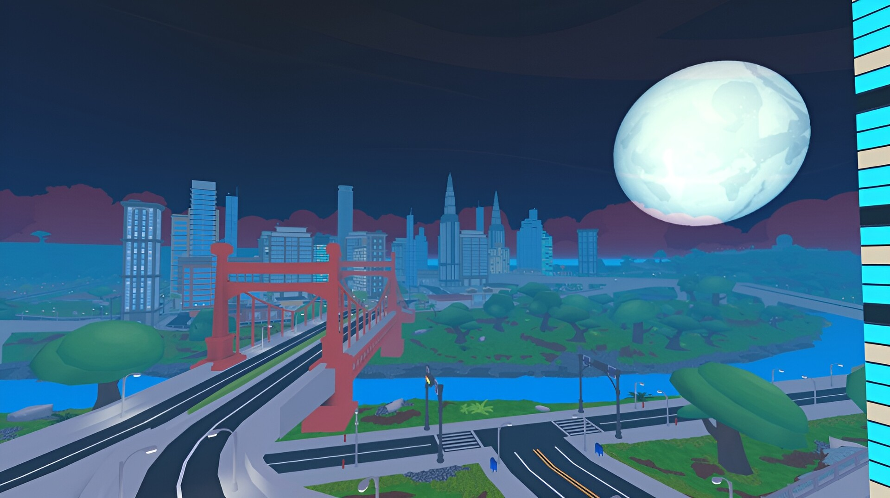
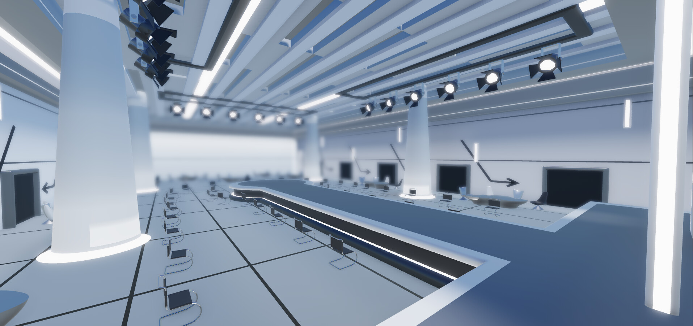

{.cover-image}

## Overview

I have been building on Roblox for 10 years. Before this portfolio became mostly analytics and machine learning, I was designing the worlds, levels, player flow, and progression spaces behind shipped games and branded events. Across the experiences I contributed to, those worlds have generated 7.5B+ plays.

I worked in world design, level design, game design, progression, environment production, build leadership, and Roblox DevRel QA. I designed environments, vehicles, terrain, city layouts, lobbies, expansion areas, and branded worlds with attention to the player journey: where people spawn, what they notice, how they move, where they gather, and what keeps the experience engaging.

A lot of this happened when Roblox brand activations were still early. I worked on projects connected to Warner Music, Sony Entertainment, DC's Black Adam, Bakugan, L'Oreal, JDRF, and other large IP campaigns. I was also personally commended by Roblox CEO David Baszucki for my work during the early interactive concert era on Roblox, including the Ava Max launch-party period.

The simple version: I learned how to build digital worlds that millions of people could enter, understand, explore, return to, and remember.

## What I Worked On

- Designed world layouts, terrain, vehicles, lobbies, expansion areas, and progression spaces for live Roblox games.
- Built branded event worlds for music, film, toy, beauty, nonprofit, and game IP, making each world readable and engaging from the first spawn.
- Led the Justice Hall area and surrounding player experience for the Black Adam promotional event.
- Designed building systems and supported the full lobby redesign for Bakugan Battle League.
- Created 30+ vehicles for Anomic's revamp and supported its larger world system.
- Built expansion worlds for Spirit Guides and helped develop Dreamworld RP from the ground up.
- Helped create the main world and supporting environments for JDRF One World.
- Helped shape the Ava Max Heaven and Hell launch-party map, including its major event environments, props, and catalog assets.

## Visual Work

::: {.viz-grid}
::: {.viz-card}

<strong>Bakugan Battle League.</strong> A branded lobby/world environment built around a global toy and entertainment franchise.
:::

::: {.viz-card}

<strong>City-scale world design.</strong> Large environment work with roads, landmarks, atmosphere, terrain, and readable player paths.
:::

::: {.viz-card}

<strong>Interior production.</strong> A clean sci-fi environment focused on lighting, spacing, scale, and mood.
:::
:::

## Selected Work

**Dreamworld RP**  
World and environment designer for Cosmow from December 2023 to February 2024. I helped develop Dreamworld RP from the ground up through terrain, city structure, nature, world population, vehicles, and player-facing environmental systems.

**Spirit Guides**  
World and environment designer from November 2022 to September 2023. I created stylized world systems, reshaped existing environments, and built new expansion spaces that added more places and reasons for players to explore.

**Black Adam Event**  
World build lead from September 2022 to October 2022. I led the Justice Hall area and surrounding player experience for the main Roblox promotional event tied to the movie.

**Bakugan Battle League**  
World and level designer from May 2022 to July 2022. I designed building systems and supported a full lobby redesign for a major global toy brand.

**Infinite Canvas**  
World production contributor from February 2022 to September 2022. I supported interactive world systems, animal rigs, and creator-led Roblox projects, including the JayPrehistoricPets collaboration.

**Anomic**  
World and vehicle designer from May 2021 to March 2022. I created 30+ vehicles for the game's revamp and contributed to the world systems around them.

**Specter**  
Game-world contributor from March 2021 to April 2021. I created new ghost characters and environment assets as part of a larger creature and gameplay refresh.

**JDRF One World**  
World designer from September 2020 to October 2020. I built the main player environment, props, and supporting spaces for the client's virtual walk concept.

**Ava Max Heaven and Hell Launch Party**  
World and event designer from August 2020 to September 2020. I helped shape the map, player routes, and major Heaven and Hell event environments for one of Roblox's early interactive music launch parties.

## How I Thought About The Work

Roblox worlds punish weak design fast. Players do not stop to read a manual. They spawn in, look around, and decide almost immediately whether the world makes sense and gives them a reason to stay.

That meant the environment had to do a lot of work:

- The first view had to tell players where they were and what was worth doing next.
- Routes, landmarks, reveal moments, and world hierarchy had to guide movement without overexplaining.
- Branded areas had to feel big without becoming confusing or losing the core game loop.
- Progression, social spaces, and repeatable moments had to give people reasons to keep playing.
- Worlds had to run on lower-end devices while supporting crowds, screenshots, and timed live moments.
- Client ideas had to become real interactive experiences that players could use immediately.

That is the part I am proud of. I was designing the shape of the experience: the level flow, the progression, the energy, and the reasons players came back.

## Results/Impact

- Contributed to shipped Roblox experiences with 7.5B+ plays.
- Worked on brand worlds and live-event environments connected to Warner Music, Sony Entertainment, DC/Black Adam, Bakugan, L'Oreal, JDRF, and other global projects.
- Helped build early Roblox music and brand activations before this category became normal across the platform.
- Created 30+ vehicles for Anomic and designed world, level, and gameplay systems across roleplay, event, horror, nonprofit, and branded experiences.
- Personally commended by Roblox CEO David Baszucki for my work during the early interactive concert era on Roblox.

## Skills

- Roblox Studio
- World design, level design, player flow, progression, and gameplay loops
- Terrain, lighting, vehicle design, environment production, and interior/exterior composition
- Performance-aware world systems for high-traffic Roblox experiences
- Brand translation from real-world IP into interactive spaces
- QA, launch readiness, client feedback, and production deadlines

## Public Context

These links are not a full list of my work, but they show the scale of the Roblox brand and music category I was building in:

- [Sony Music and Roblox partnership](https://www.sonymusic.com/sonymusic/roblox-partnership/)
- [Warner Music Group Roblox experience context](https://www.wmg.com/news/warner-music-group-announces-the-launch-of-rhythm-city-its-first-persistent-music-experience-on-roblox)
- [Bakugan Battle League Roblox event](https://bakugan.wiki/wiki/Bakugan_Battle_League_(Roblox))
- [L'Oreal metaverse/avatar context](https://www.loreal.com/en/press-release/group/loreal-partnership-with-metaverse-avatar-platform-ready-player-me/)
