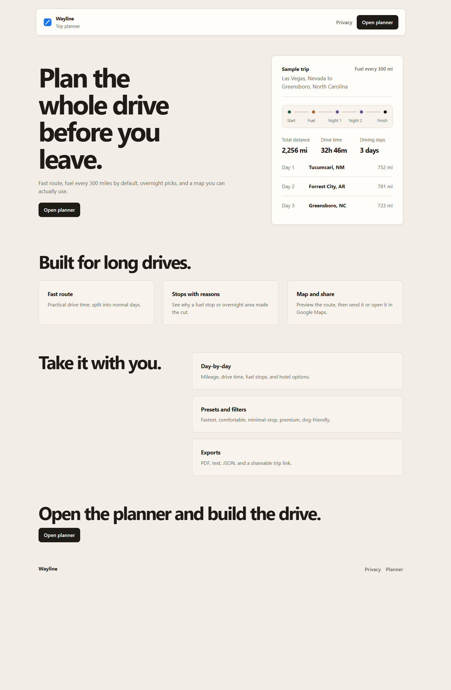
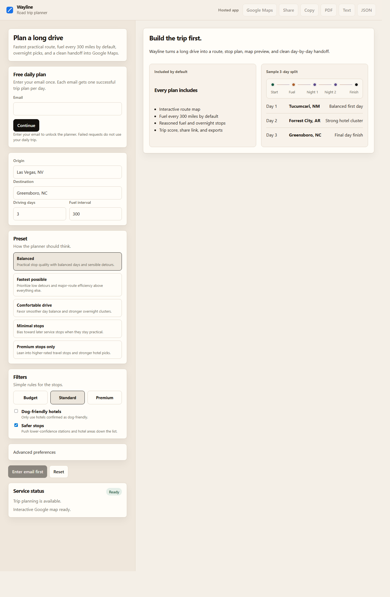
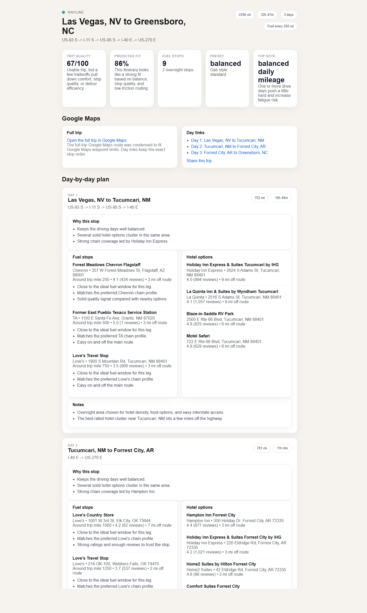
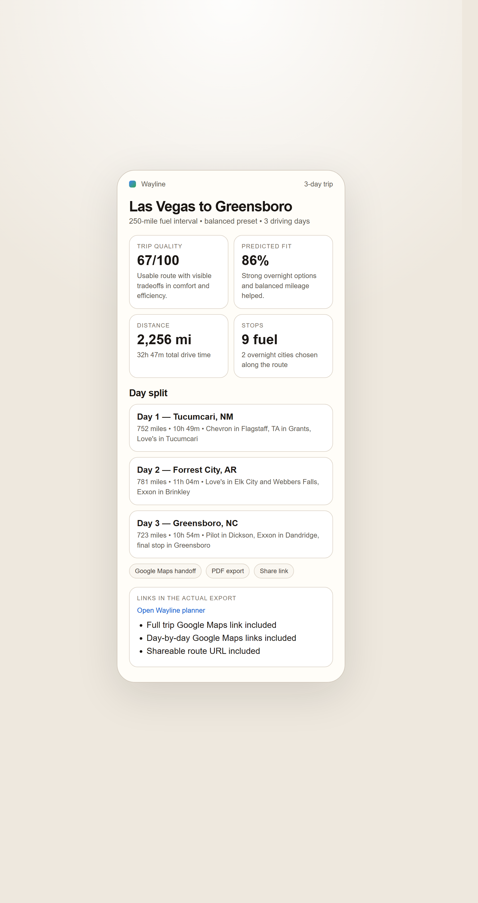
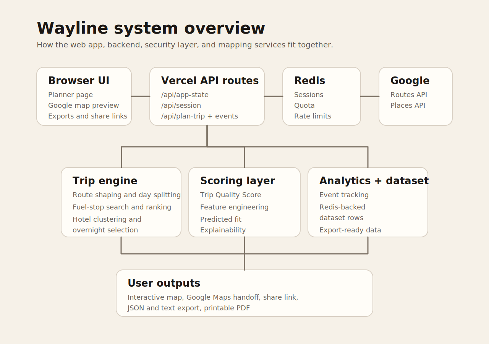
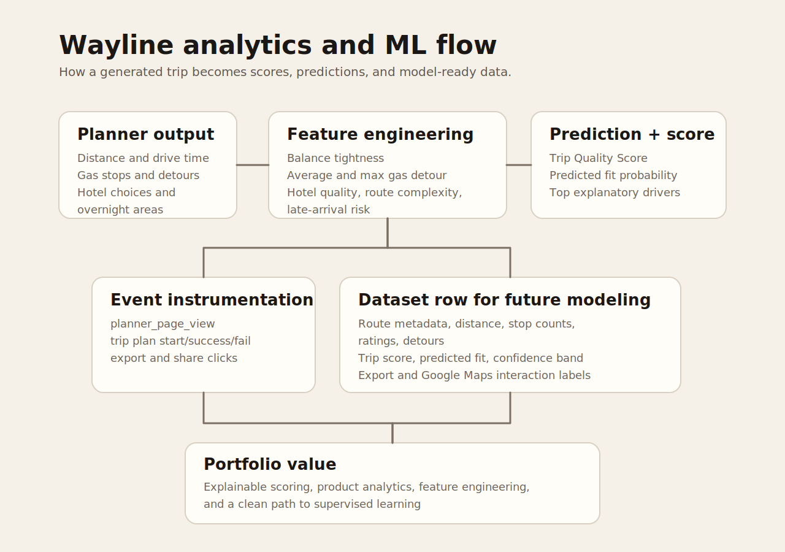

{.cover-image}

::: {.hero-actions}
[Open Live App](https://wayline.vercel.app/){.btn-primary target="_blank" rel="noopener"}
[Planner](https://wayline.vercel.app/planner/){.btn-ghost target="_blank" rel="noopener"}
[App Repo](https://github.com/msaule/wayline-app){.btn-ghost target="_blank" rel="noopener"}
[Public Site Repo](https://github.com/msaule/wayline){.btn-ghost target="_blank" rel="noopener"}
:::

## Overview

Wayline is a production-minded road trip planning system built around a simple question: what would make a long-distance drive actually usable, explainable, and worth trusting?

The project goes beyond plotting a route. It combines route orchestration, fuel-stop planning, overnight-city selection, hotel discovery, trip scoring, product analytics, protected API usage, and exportable planning outputs. I treated it like a product system rather than a static demo: every major user action can be measured, every trip can be exported, and every paid Google Maps request is protected behind session and quota controls.

## What I Built

- Built a hosted trip-planning app with a public marketing surface and a protected planner workflow.
- Integrated Google Routes, Places, and Maps surfaces to generate realistic route, fuel, hotel, and map experiences.
- Designed a trip-quality scoring system that explains route efficiency, comfort balance, fuel-stop quality, overnight practicality, and preference fit.
- Added a lightweight predictive fit layer using engineered trip features and logistic-style scoring.
- Implemented email-gated access, signed sessions, CSRF protection, rate limits, Redis locks, and daily planning quotas to protect paid backend usage.
- Added export paths for PDF, text, JSON, share links, and Google Maps handoff.
- Instrumented the product with analytics events across planner views, email gate submissions, trip planning, quota blocks, exports, sharing, and result views.

## Product Screenshots

::: {.viz-grid}
::: {.viz-card}

<strong>Planner intake.</strong> The trip form captures origin, destination, driving days, fuel interval, route preference, and trip assumptions before any paid route computation runs.
:::

::: {.viz-card}

<strong>Desktop result.</strong> The output combines route summary, overnight cities, fuel stops, hotels, map handoff, exports, and explainable trip scoring.
:::

::: {.viz-card}

<strong>Mobile result.</strong> The result page remains usable on a phone, which matters because road trip planning is often checked while traveling.
:::
:::

## Analytics and System Design

::: {.viz-grid}
::: {.viz-card}

<strong>Architecture.</strong> The app separates the browser experience, server-side route orchestration, Google Maps services, Redis-backed sessions, quota controls, and export generation.
:::

::: {.viz-card}

<strong>Analytics layer.</strong> Trip features, scoring outputs, and product events are structured so future model training and funnel analysis can build on clean data.
:::
:::

The core design choice was to make the planner explainable. If Wayline says a trip is practical, the user can see why. If the fit score is lower, the system exposes the tradeoffs instead of hiding them behind a black-box recommendation.

## Results/Impact

- Generated a complete Las Vegas, Nevada to Greensboro, North Carolina itinerary: 2,256 miles, 32 hours 47 minutes of drive time, 3 driving days, 9 fuel stops, and overnight stops in Tucumcari, New Mexico and Forrest City, Arkansas.
- Produced a trip quality score of 67/100 and a predicted trip fit of 86% for the sample route.
- Created multiple usable outputs from one planning run: interactive result page, Google Maps route handoff, PDF itinerary, text itinerary, JSON export, and shareable trip link.
- Built the project as a measurable product, not just a visual route demo, with event tracking and dataset-export scaffolding for future model evaluation.

## Tech Stack

- Frontend: HTML, CSS, JavaScript, responsive product UI
- Backend: Node.js, Vercel serverless functions, route orchestration services
- APIs: Google Routes API, Google Places API, Google Maps handoff
- Data and infrastructure: Redis sessions, quotas, locks, rate limits, analytics events, structured JSON exports
- Modeling: engineered trip features, rule-based trip scoring, lightweight predictive fit layer

## Deliverables

- [Live Wayline app](https://wayline.vercel.app/){target="_blank" rel="noopener"}
- [Planner workflow](https://wayline.vercel.app/planner/){target="_blank" rel="noopener"}
- [GitHub repo: wayline-app](https://github.com/msaule/wayline-app){target="_blank" rel="noopener"}
- [GitHub repo: wayline public site](https://github.com/msaule/wayline){target="_blank" rel="noopener"}
- [GitHub Pages mirror](https://msaule.github.io/wayline/){target="_blank" rel="noopener"}
- [Sample PDF itinerary](../files/wayline/Wayline%20Vegas%20to%20Greensboro%20250mi.pdf){target="_blank" rel="noopener"}
- [Sample JSON export](../files/wayline/vegas-greensboro-250.json){target="_blank" rel="noopener"}
- [Sample text itinerary](../files/wayline/vegas-greensboro-250.txt){target="_blank" rel="noopener"}

